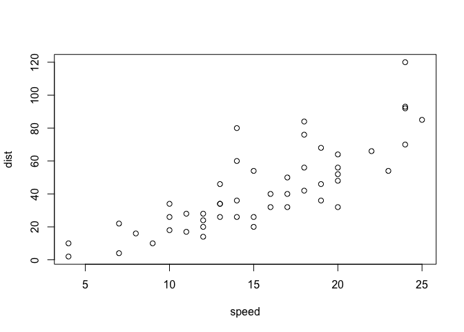
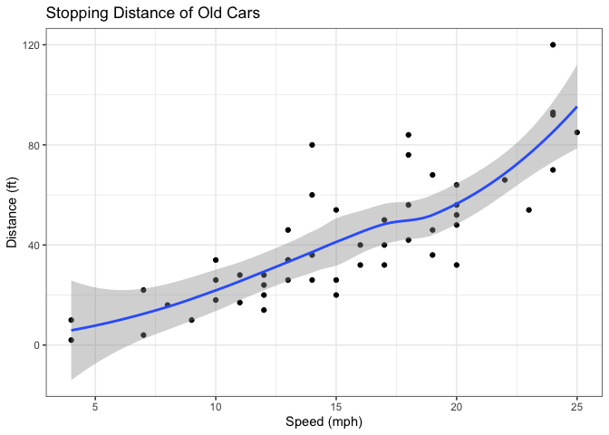
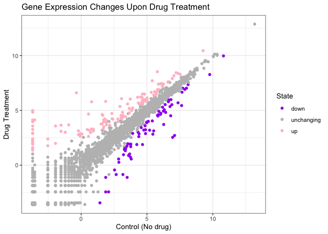
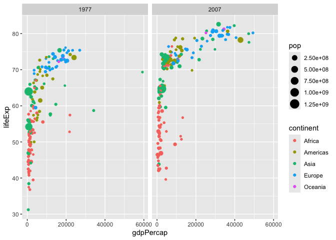
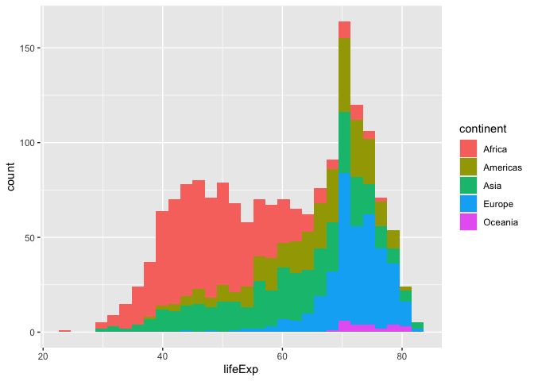
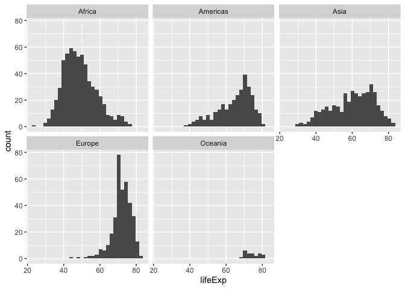

# Class 05: Data Viz with ggplot2
Dea Sinaga (PID: A17725676)

- [Background](#background)
- [Add some custom features](#add-some-custom-features)
- [Gene Expression Figure](#gene-expression-figure)
- [Going Further](#going-further)

## Background

There are many graphics systems in R for making plots and figures. These
include so-called *“base R” graphics* like the ‘plot()’ function and add
on packages like ““ggplot2”“.

Let’s compare how we make a simple figure with these two systems:

We can use the in-built ‘cars’ dataset:

``` r
plot(cars)
```



Before I can use ggplot2 I need to install it on my computer. To do this
we can use the function ‘install.packages(“ggplot2”)’

> **N.B.** We never run ‘install.packakges()’ in our quarto doc (we run
> it once only in our R console) as it would re-install the package
> every time we render our qurto report.

Once installed we need to load up the package into our R brain:

``` r
library(ggplot2)
```

The main function in the **ggplot2** package is called ‘ggplot()’

``` r
ggplot(cars)
```


Every ggplot has at least 3 layers:

- the **data** (a data.frame of the stuff we want to plot)
- the **aes**thetics (how the data maps to the plot)
- the **geom** layer (how you want the plot drawn, e.g. points, lines,
  etc.)

``` r
ggplot(cars) +
  aes(x=speed, y=dist) +
  geom_point()
```


## Add some custom features

Let’s add a trend line that shows the relationship between speed and
distance.

``` r
ggplot(cars) +
  aes(x=speed, y=dist) +
  geom_point() +
  geom_smooth() +
  theme_bw() +
  labs(title="Stopping Distance of Old Cars", x="Speed (mph)", y="Distance (ft)")
```

    `geom_smooth()` using method = 'loess' and formula = 'y ~ x'



> Q. Can you make the ‘geom_smooth()’ function produce a linear straight
> line fit to the data and turn off the “gray” error region.

------------------------------------------------------------------------

## Gene Expression Figure

Import the data plot

``` r
url <- url <- "https://bioboot.github.io/bimm143_S20/class-material/up_down_expression.txt"
genes <- read.delim(url)
head(genes)
```

            Gene Condition1 Condition2      State
    1      A4GNT -3.6808610 -3.4401355 unchanging
    2       AAAS  4.5479580  4.3864126 unchanging
    3      AASDH  3.7190695  3.4787276 unchanging
    4       AATF  5.0784720  5.0151916 unchanging
    5       AATK  0.4711421  0.5598642 unchanging
    6 AB015752.4 -3.6808610 -3.5921390 unchanging

``` r
sum(genes$State == "up")
```

    [1] 127

A useful new function in this context is the ‘table()’ function:

``` r
table(genes$State)
```


          down unchanging         up 
            72       4997        127 

My first plot attempt

``` r
ggplot(genes) +
  aes(Condition1, Condition2, col=State) +
  geom_point() +
  scale_colour_manual(values=c("purple", "grey", "pink")) +
  theme_bw() +
  labs (x="Control (No drug)", y="Drug Treatment", title="Gene Expression Changes Upon Drug Treatment")
```



## Going Further

Here we read the famous gapminder dataset:

``` r
# File location online
url <- "https://raw.githubusercontent.com/jennybc/gapminder/master/inst/extdata/gapminder.tsv"

gapminder <- read.delim(url)
```

> Q. How many entries (i.e. rows) are in this dataset?

``` r
nrow(gapminder)
```

    [1] 1704

``` r
length(unique(gapminder$country))
```

    [1] 142

Let’s make our first plot of the entire dataset:

Plot of “gdpPercap” vs “lifeExp” colored by “continent”

``` r
ggplot(gapminder) +
  aes(x=gdpPercap, y=lifeExp) +
  geom_point()
```


I can add more layers to “p”

``` r
ggplot(gapminder) +
  aes(x=gdpPercap, y=lifeExp, color=continent) +
  geom_point() +
  facet_wrap(~continent)
```


Make a plot for 1977 and 2007 only (not all the years in the dataset).

> Q. First use the **dplyr** package and the ‘filter()’ function from
> that package to extract the rows from the year 2007.

``` r
library(dplyr)
```

``` r
g07 <- filter(gapminder, year == 2007)
g77 <- filter(gapminder, year == 1977)
g <- filter(gapminder, year == 2007 | year == 1977)
```

``` r
ggplot(g) +
  aes(x=gdpPercap, y=lifeExp, color=continent, size=pop) +
  geom_point() +
  facet_wrap(~year)
```



> Q. Make a histogram of lifeExp colored by continent

``` r
ggplot(gapminder)+
  aes(lifeExp, fill=continent) +
  geom_histogram()
```

    `stat_bin()` using `bins = 30`. Pick better value `binwidth`.



> Q. Make a histogram of lifeExp faceted by continent

``` r
ggplot(gapminder)+
  aes(lifeExp) +
  geom_histogram() +
  facet_wrap("continent")
```

    `stat_bin()` using `bins = 30`. Pick better value `binwidth`.


