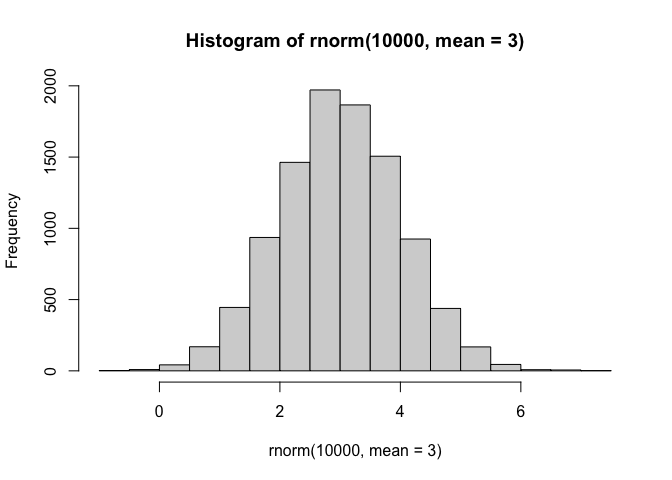
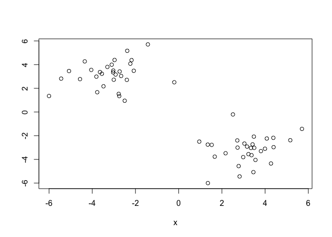
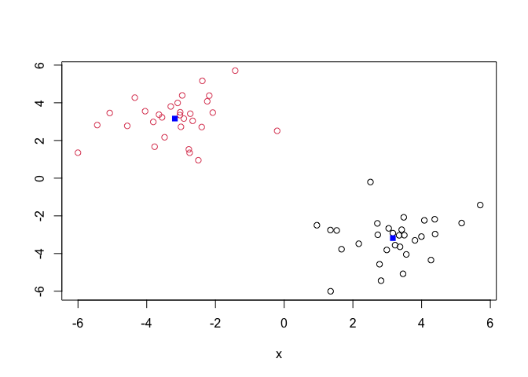
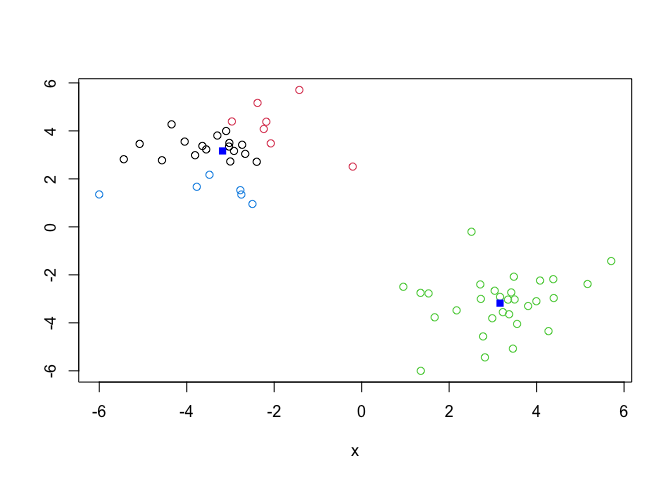
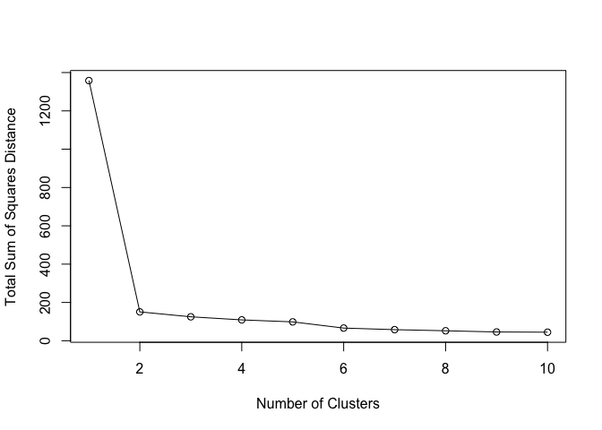
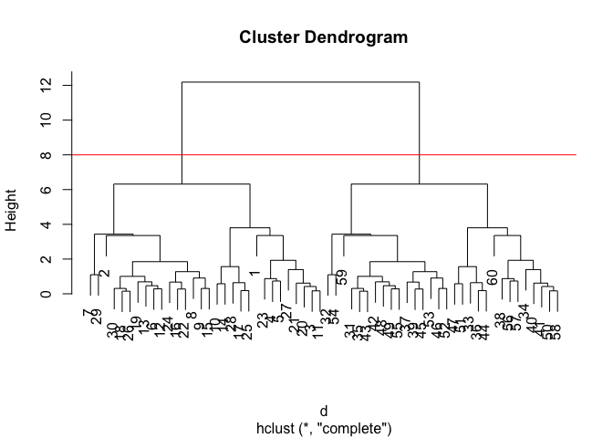
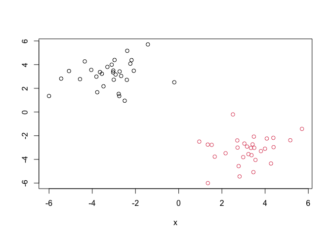
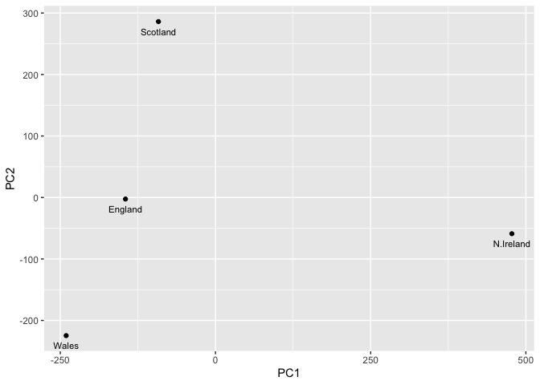
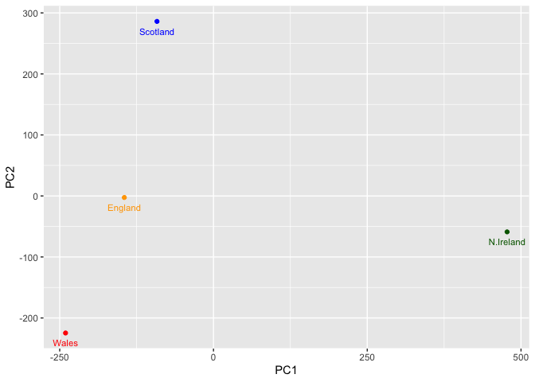

# Class 7: Machine Learning 1
Dea Sinaga (PID: A17725676)

- [Background](#background)
- [K-means clustering](#k-means-clustering)
- [Hierarchical Clustering](#hierarchical-clustering)
- [Principal Component Analysis
  (PCA)](#principal-component-analysis-pca)
  - [Analysis of UK food data](#analysis-of-uk-food-data)
- [Data Import](#data-import)
- [Tidy the data](#tidy-the-data)
- [Exporatory analysis](#exporatory-analysis)
- [PCA to the rescue](#pca-to-the-rescue)

## Background

Today we will explore some core machine learning methods that are very
popular in bioinformatics. These include **clustering** and
**dimensionallity**.

## K-means clustering

The main function in “base” R for K-means clustering is called
‘kmeans()’.

Before we go too deep let’s make up some “simple” data that we can
cluster and know if we are getting a good answer or not. To help us do
this we can use the ‘rnorm()’ function.

``` r
hist(rnorm(10000, mean=3))
```



``` r
x <- c(rnorm(30, mean=-3), rnorm(30, mean=3))
z <- cbind(x, rev(x))
plot(z)
```



Now we can run ‘kmeans()’ on this input ‘z’ and see what the results
look like.

``` r
km <- kmeans(z, centers=2)
km
```

    K-means clustering with 2 clusters of sizes 30, 30

    Cluster means:
              x          
    1  3.163475 -3.180308
    2 -3.180308  3.163475

    Clustering vector:
     [1] 2 2 2 2 2 2 2 2 2 2 2 2 2 2 2 2 2 2 2 2 2 2 2 2 2 2 2 2 2 2 1 1 1 1 1 1 1 1
    [39] 1 1 1 1 1 1 1 1 1 1 1 1 1 1 1 1 1 1 1 1 1 1

    Within cluster sum of squares by cluster:
    [1] 75.38456 75.38456
     (between_SS / total_SS =  88.9 %)

    Available components:

    [1] "cluster"      "centers"      "totss"        "withinss"     "tot.withinss"
    [6] "betweenss"    "size"         "iter"         "ifault"      

``` r
attributes(km)
```

    $names
    [1] "cluster"      "centers"      "totss"        "withinss"     "tot.withinss"
    [6] "betweenss"    "size"         "iter"         "ifault"      

    $class
    [1] "kmeans"

> Q. How many points are in each cluster?

``` r
km$size
```

    [1] 30 30

> Q. What component of your result object details cluster
> assignment/membership?

``` r
km$cluster
```

     [1] 2 2 2 2 2 2 2 2 2 2 2 2 2 2 2 2 2 2 2 2 2 2 2 2 2 2 2 2 2 2 1 1 1 1 1 1 1 1
    [39] 1 1 1 1 1 1 1 1 1 1 1 1 1 1 1 1 1 1 1 1 1 1

> Q. What component of your result object details cluster center?

``` r
km$centers
```

              x          
    1  3.163475 -3.180308
    2 -3.180308  3.163475

> Q. Plot ‘z’ colored by the kmeans cluster assignment and add cluster
> centers as blue points.

``` r
plot(z,col=c(km$cluster))
points(km$centers, col="blue", pch=15)
```



> Q. Run a k-means clustering and plot the results asking for 4 clusters
> (k=4).

``` r
km4 <- kmeans(z, centers=4)
plot(z,col=km4$cluster)
points(km$center, col="blue", pch=15)
```



> **N.B.** You need to tell K-means the number of clusters (i.e. set
> ‘center=2’)

One approach is to try different values for ‘centers’ and then pick the
best …

``` r
ans <- NULL
for(i in 1:10) {
km <- kmeans(z, centers=i)
ans <- c(ans, km$tot.withinss)
}

plot(ans, typ="o", xlab="Number of Clusters", ylab="Total Sum of Squares Distance")
```



## Hierarchical Clustering

The main function in “base” R for Hierarchical Clustering is called
‘hclust()’.

This function does not take your “raw” data for clustering. You must
first build a “distance matrix” from your data and pass this as input to
‘hclust()’.

``` r
d <- dist(z)
hc <- hclust(d)
hc
```


    Call:
    hclust(d = d)

    Cluster method   : complete 
    Distance         : euclidean 
    Number of objects: 60 

There is a bespoke ‘plot()’ method for ‘hclust()’ result objects.

``` r
plot(hc)
abline(h=8, col="red")
```



Once we have our ‘hclust’ object (our “tree” of “cluster dendogram”), we
can *“cut”* the tree to reveal the clsutering pattern.

``` r
cutree(hc, h=8)
```

     [1] 1 1 1 1 1 1 1 1 1 1 1 1 1 1 1 1 1 1 1 1 1 1 1 1 1 1 1 1 1 1 2 2 2 2 2 2 2 2
    [39] 2 2 2 2 2 2 2 2 2 2 2 2 2 2 2 2 2 2 2 2 2 2

``` r
cutree(hc, k=4)
```

     [1] 1 2 1 1 1 2 2 2 2 1 1 2 2 1 2 2 1 2 2 1 1 2 1 2 1 2 1 1 2 2 3 3 4 4 3 4 3 4
    [39] 3 4 4 3 3 4 3 3 4 3 3 4 4 3 3 3 3 4 4 4 3 4

> Q. Make a plot of ‘z’ with your hclust results (i.e. colored by
> cluster membership).

``` r
grps <- cutree(hc, k=2)
plot(z, col=grps)
```



## Principal Component Analysis (PCA)

PCA is a dimensionallity reduction method that is popular for revealing
patterns in complex datasets.

### Analysis of UK food data

Let’s look at some data on the eating habits of folks from the UK to see
if there are patterns and trends that have some regions being distinct
from others.

## Data Import

The data is made available in CSV format so we can use the ‘read.csv()’
function for import to R:

``` r
url <- "https://tinyurl.com/UK-foods"
x <- read.csv(url)
x
```

                         X England Wales Scotland N.Ireland
    1               Cheese     105   103      103        66
    2        Carcass_meat      245   227      242       267
    3          Other_meat      685   803      750       586
    4                 Fish     147   160      122        93
    5       Fats_and_oils      193   235      184       209
    6               Sugars     156   175      147       139
    7      Fresh_potatoes      720   874      566      1033
    8           Fresh_Veg      253   265      171       143
    9           Other_Veg      488   570      418       355
    10 Processed_potatoes      198   203      220       187
    11      Processed_Veg      360   365      337       334
    12        Fresh_fruit     1102  1137      957       674
    13            Cereals     1472  1582     1462      1494
    14           Beverages      57    73       53        47
    15        Soft_drinks     1374  1256     1572      1506
    16   Alcoholic_drinks      375   475      458       135
    17      Confectionery       54    64       62        41

> **Q1**. How many rows and columns are in your new data frame named x?
> What R functions could you use to answer this questions?

``` r
nrow(x)
```

    [1] 17

``` r
ncol(x)
```

    [1] 5

## Tidy the data

``` r
x <- read.csv(url, row.names=1)
head(x)
```

                   England Wales Scotland N.Ireland
    Cheese             105   103      103        66
    Carcass_meat       245   227      242       267
    Other_meat         685   803      750       586
    Fish               147   160      122        93
    Fats_and_oils      193   235      184       209
    Sugars             156   175      147       139

> **Q2**. Which approach to solving the ‘row-names problem’ mentioned
> above do you prefer and why? Is one approach more robust than another
> under certain circumstances?

Setting the row.names argument of read.csv to be the first column.

## Exporatory analysis

Make some plots to help make sense of obvious trends.

``` r
barplot(as.matrix(x), beside=T, col=rainbow(nrow(x)))
```


> **Q3**: Changing what optional argument in the above barplot()
> function results in the following plot?

Setting the ‘beside’ argument to “FALSE”.

``` r
barplot(as.matrix(x), beside=FALSE, col=rainbow(nrow(x)))
```


> **Q4**: Changing what optional argument in the below ggplot() code
> results in a stacked barplot figure?

Change the argument of the geom_col() function to “stack” instead of
“dodge”.

> **Q5**: We can use the pairs() function to generate all pairwise plots
> for our countries. Can you make sense of the following code and
> resulting figure? What does it mean if a given point lies on the
> diagonal for a given plot?

``` r
pairs(x, col=rainbow(nrow(x)), pch=16)
```


> **Q6**. Based on the pairs and heatmap figures, which countries
> cluster together and what does this suggest about their food
> consumption patterns? Can you easily tell what the main differences
> between N. Ireland and the other countries of the UK in terms of this
> data-set?

``` r
library(pheatmap)

pheatmap(as.matrix(x))
```


England and Wales cluster together, suggesting that their food
consumption patterns are more similar. N. Ireland is in a separated
cluster alone, but it’s hard to tell what the differences are between it
and the other countries of the UK.

> **Key-point**: Even relatively small datasets can prove challenging to
> interpret.

## PCA to the rescue

The main function in “base” R for PCA is called ‘prcomp()’. This
function wants the “observations” to be rows and the “variables” to be
columns.

So here we need to take the transpose of our ‘x’ input object.

``` r
pca <- prcomp(t(x))
summary(pca)
```

    Importance of components:
                                PC1      PC2      PC3       PC4
    Standard deviation     324.1502 212.7478 73.87622 2.921e-14
    Proportion of Variance   0.6744   0.2905  0.03503 0.000e+00
    Cumulative Proportion    0.6744   0.9650  1.00000 1.000e+00

The returned pca plot has attributes that we want:

``` r
attributes(pca)
```

    $names
    [1] "sdev"     "rotation" "center"   "scale"    "x"       

    $class
    [1] "prcomp"

The main result from this analysis is called a “PC score plot” or
“ordenation plot” or “PC plot” or “PC1 vs PC2” plot.

This plot shows how samples (in this case countries) relate to each
other along our new PC axis.

This is called new “reduced-dimensional space”. In this case 2
dimensions, PC1 and PC2, that capture most of the variance

``` r
pca$x
```

                     PC1         PC2        PC3           PC4
    England   -144.99315   -2.532999 105.768945 -9.152022e-15
    Wales     -240.52915 -224.646925 -56.475555  5.560040e-13
    Scotland   -91.86934  286.081786 -44.415495 -6.638419e-13
    N.Ireland  477.39164  -58.901862  -4.877895  1.329771e-13

> **Q7**. Complete the code below to generate a plot of PC1 vs PC2. The
> second line adds text labels over the data points.

``` r
library(ggplot2)

ggplot(pca$x) +
  aes(PC1, PC2)+
  geom_point()
```


``` r
ggplot(pca$x) +
  aes(PC1, PC2, label=row.names(pca$x))+
  geom_point() +
  geom_text(size=3, vjust=2)
```



> **Q8**. Customize your plot so that the colors of the country names
> match the colors in our UK and Ireland map and table at start of this
> document.

``` r
mycols <- c("orange", "red", "blue", "darkgreen")

ggplot(pca$x) +
  aes(PC1, PC2, label=row.names(pca$x))+
  geom_point(col=mycols) +
  geom_text(size=3, vjust=2, col=mycols)
```



``` r
ggplot(pca$rotation) +
  aes(x = PC1, 
      y = reorder(rownames(pca$rotation), PC1)) +
  geom_col(fill = "steelblue") +
  xlab("PC1 Loading Score") +
  ylab("") +
  theme_bw() +
  theme(axis.text.y = element_text(size = 9))
```


> **Q9**: Generate a similar ‘loadings plot’ for PC2. What two food
> groups feature prominantely and what does PC2 maninly tell us about?

``` r
ggplot(pca$rotation) +
  aes(x = PC2, 
      y = reorder(rownames(pca$rotation), PC2)) +
  geom_col(fill = "steelblue") +
  xlab("PC2 Loading Score") +
  ylab("") +
  theme_bw() +
  theme(axis.text.y = element_text(size = 9))
```


Based on the graph above, soft drinks are more positively associated
with Scotland, while fresh potatoes are more positively assocaited with
the other regions. PC2 mainly tells us what food groups make Scotland
distinct from other countries in the PCA plot.

Note: The score plot and loading plot are different. The score plot
shows the patterns (what group is more distinct than the rest) and the
loading plot shows why it happened (what makes it distinct).
