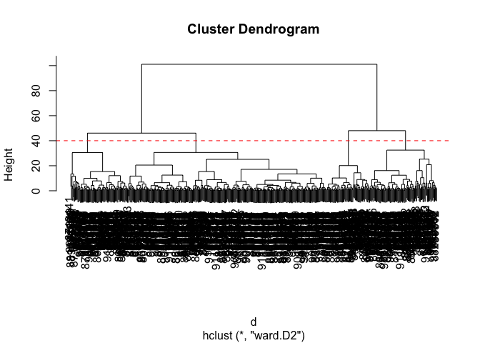

# Class 8: Unsupervised Learning Analysis of Human Breast Cancer Cells
Dea Sinaga (PID: A17725676)

- [Background](#background)
- [Data Import](#data-import)
- [Exploratory data analysis](#exploratory-data-analysis)
- [Principal Component Analysis](#principal-component-analysis)
- [Hierarchical clustering](#hierarchical-clustering)
- [Combining Methods](#combining-methods)
- [Prediction](#prediction)

## Background

The goal of this mini-project is for you to explore a complete analysis
using the unsupervised learning techniques covered in class.

Today we will analyze a biopsy data-set from fine needle aspiration
(FNA) of breast mass.

## Data Import

The data is made available as a CSV file for download. We can read this
in using ‘read.csv()’:

``` r
fna.data <- "WisconsinCancer.csv"
wisc.df <- read.csv(fna.data, row.names=1)
```

Make sure we remove or exclude the ‘diagnosis’ column from the data set
that we use for further analysis - this is the expert diagnosis as
either M or B.

``` r
wisc.data <- wisc.df[,-1]
diagnosis <- as.factor(wisc.df$diagnosis)
```

## Exploratory data analysis

> **Q1.** How many observations are in this dataset?

``` r
nrow(wisc.data)
```

    [1] 569

> **Q2.** How many of the observations have a malignant diagnosis?

``` r
table(wisc.df$diagnosis)
```


      B   M 
    357 212 

212 observations have a malignant diagnosis.

> **Q3.** How many variables/features in the data set are suffixed with
> \_mean?

We can use the ‘grep()’ function to help us here:

``` r
colnames(wisc.data)
```

     [1] "radius_mean"             "texture_mean"           
     [3] "perimeter_mean"          "area_mean"              
     [5] "smoothness_mean"         "compactness_mean"       
     [7] "concavity_mean"          "concave.points_mean"    
     [9] "symmetry_mean"           "fractal_dimension_mean" 
    [11] "radius_se"               "texture_se"             
    [13] "perimeter_se"            "area_se"                
    [15] "smoothness_se"           "compactness_se"         
    [17] "concavity_se"            "concave.points_se"      
    [19] "symmetry_se"             "fractal_dimension_se"   
    [21] "radius_worst"            "texture_worst"          
    [23] "perimeter_worst"         "area_worst"             
    [25] "smoothness_worst"        "compactness_worst"      
    [27] "concavity_worst"         "concave.points_worst"   
    [29] "symmetry_worst"          "fractal_dimension_worst"

``` r
length(grep("_mean", colnames(wisc.data), value=T))
```

    [1] 10

## Principal Component Analysis

We need to scale our data before PCA with the ‘scale=TRUE’ argument to
‘prcomp()’.

``` r
wisc.pr <- prcomp(wisc.data, scale=TRUE)
summary(wisc.pr)
```

    Importance of components:
                              PC1    PC2     PC3     PC4     PC5     PC6     PC7
    Standard deviation     3.6444 2.3857 1.67867 1.40735 1.28403 1.09880 0.82172
    Proportion of Variance 0.4427 0.1897 0.09393 0.06602 0.05496 0.04025 0.02251
    Cumulative Proportion  0.4427 0.6324 0.72636 0.79239 0.84734 0.88759 0.91010
                               PC8    PC9    PC10   PC11    PC12    PC13    PC14
    Standard deviation     0.69037 0.6457 0.59219 0.5421 0.51104 0.49128 0.39624
    Proportion of Variance 0.01589 0.0139 0.01169 0.0098 0.00871 0.00805 0.00523
    Cumulative Proportion  0.92598 0.9399 0.95157 0.9614 0.97007 0.97812 0.98335
                              PC15    PC16    PC17    PC18    PC19    PC20   PC21
    Standard deviation     0.30681 0.28260 0.24372 0.22939 0.22244 0.17652 0.1731
    Proportion of Variance 0.00314 0.00266 0.00198 0.00175 0.00165 0.00104 0.0010
    Cumulative Proportion  0.98649 0.98915 0.99113 0.99288 0.99453 0.99557 0.9966
                              PC22    PC23   PC24    PC25    PC26    PC27    PC28
    Standard deviation     0.16565 0.15602 0.1344 0.12442 0.09043 0.08307 0.03987
    Proportion of Variance 0.00091 0.00081 0.0006 0.00052 0.00027 0.00023 0.00005
    Cumulative Proportion  0.99749 0.99830 0.9989 0.99942 0.99969 0.99992 0.99997
                              PC29    PC30
    Standard deviation     0.02736 0.01153
    Proportion of Variance 0.00002 0.00000
    Cumulative Proportion  1.00000 1.00000

Let’s see the “PC score plot”

``` r
library(ggplot2)

ggplot(wisc.pr$x) +
  aes(PC1, PC2, col=diagnosis) +
  geom_point()
```


``` r
colMeans(wisc.data)
```

                radius_mean            texture_mean          perimeter_mean 
               1.412729e+01            1.928965e+01            9.196903e+01 
                  area_mean         smoothness_mean        compactness_mean 
               6.548891e+02            9.636028e-02            1.043410e-01 
             concavity_mean     concave.points_mean           symmetry_mean 
               8.879932e-02            4.891915e-02            1.811619e-01 
     fractal_dimension_mean               radius_se              texture_se 
               6.279761e-02            4.051721e-01            1.216853e+00 
               perimeter_se                 area_se           smoothness_se 
               2.866059e+00            4.033708e+01            7.040979e-03 
             compactness_se            concavity_se       concave.points_se 
               2.547814e-02            3.189372e-02            1.179614e-02 
                symmetry_se    fractal_dimension_se            radius_worst 
               2.054230e-02            3.794904e-03            1.626919e+01 
              texture_worst         perimeter_worst              area_worst 
               2.567722e+01            1.072612e+02            8.805831e+02 
           smoothness_worst       compactness_worst         concavity_worst 
               1.323686e-01            2.542650e-01            2.721885e-01 
       concave.points_worst          symmetry_worst fractal_dimension_worst 
               1.146062e-01            2.900756e-01            8.394582e-02 

``` r
apply(wisc.data,2,sd)
```

                radius_mean            texture_mean          perimeter_mean 
               3.524049e+00            4.301036e+00            2.429898e+01 
                  area_mean         smoothness_mean        compactness_mean 
               3.519141e+02            1.406413e-02            5.281276e-02 
             concavity_mean     concave.points_mean           symmetry_mean 
               7.971981e-02            3.880284e-02            2.741428e-02 
     fractal_dimension_mean               radius_se              texture_se 
               7.060363e-03            2.773127e-01            5.516484e-01 
               perimeter_se                 area_se           smoothness_se 
               2.021855e+00            4.549101e+01            3.002518e-03 
             compactness_se            concavity_se       concave.points_se 
               1.790818e-02            3.018606e-02            6.170285e-03 
                symmetry_se    fractal_dimension_se            radius_worst 
               8.266372e-03            2.646071e-03            4.833242e+00 
              texture_worst         perimeter_worst              area_worst 
               6.146258e+00            3.360254e+01            5.693570e+02 
           smoothness_worst       compactness_worst         concavity_worst 
               2.283243e-02            1.573365e-01            2.086243e-01 
       concave.points_worst          symmetry_worst fractal_dimension_worst 
               6.573234e-02            6.186747e-02            1.806127e-02 

``` r
wisc.pr <- prcomp(wisc.data, scale. = TRUE)
summary(wisc.pr)
```

    Importance of components:
                              PC1    PC2     PC3     PC4     PC5     PC6     PC7
    Standard deviation     3.6444 2.3857 1.67867 1.40735 1.28403 1.09880 0.82172
    Proportion of Variance 0.4427 0.1897 0.09393 0.06602 0.05496 0.04025 0.02251
    Cumulative Proportion  0.4427 0.6324 0.72636 0.79239 0.84734 0.88759 0.91010
                               PC8    PC9    PC10   PC11    PC12    PC13    PC14
    Standard deviation     0.69037 0.6457 0.59219 0.5421 0.51104 0.49128 0.39624
    Proportion of Variance 0.01589 0.0139 0.01169 0.0098 0.00871 0.00805 0.00523
    Cumulative Proportion  0.92598 0.9399 0.95157 0.9614 0.97007 0.97812 0.98335
                              PC15    PC16    PC17    PC18    PC19    PC20   PC21
    Standard deviation     0.30681 0.28260 0.24372 0.22939 0.22244 0.17652 0.1731
    Proportion of Variance 0.00314 0.00266 0.00198 0.00175 0.00165 0.00104 0.0010
    Cumulative Proportion  0.98649 0.98915 0.99113 0.99288 0.99453 0.99557 0.9966
                              PC22    PC23   PC24    PC25    PC26    PC27    PC28
    Standard deviation     0.16565 0.15602 0.1344 0.12442 0.09043 0.08307 0.03987
    Proportion of Variance 0.00091 0.00081 0.0006 0.00052 0.00027 0.00023 0.00005
    Cumulative Proportion  0.99749 0.99830 0.9989 0.99942 0.99969 0.99992 0.99997
                              PC29    PC30
    Standard deviation     0.02736 0.01153
    Proportion of Variance 0.00002 0.00000
    Cumulative Proportion  1.00000 1.00000

> **Q4.** From your results, what proportion of the original variance is
> captured by the first principal component (PC1)?

0.4427

> **Q5.** How many principal components (PCs) are required to describe
> at least 70% of the original variance in the data?

3

> **Q6.** How many principal components (PCs) are required to describe
> at least 90% of the original variance in the data?

7

> **Q7.** What stands out to you about this plot? Is it easy or
> difficult to understand? Why?

``` r
biplot(wisc.pr)
```


Everything is on top of each other, so it’s very difficult to
understand.

> **Q8.** Generate a similar plot for principal components 1 and 3. What
> do you notice about these plots?

``` r
ggplot(wisc.pr$x) +
  aes(PC1, PC3, col=diagnosis) +
  geom_point()
```


There’s a separation between the red (benign) and blue (malignant)
samples.

> **Q9.** For the first principal component, what is the component of
> the loading vector (i.e. wisc.pr\$rotation\[,1\]) for the feature
> concave.points_mean? This tells us how much this original feature
> contributes to the first PC. Are there any features with larger
> contributions than this one?

``` r
wisc.pr$rotation[,1]
```

                radius_mean            texture_mean          perimeter_mean 
                -0.21890244             -0.10372458             -0.22753729 
                  area_mean         smoothness_mean        compactness_mean 
                -0.22099499             -0.14258969             -0.23928535 
             concavity_mean     concave.points_mean           symmetry_mean 
                -0.25840048             -0.26085376             -0.13816696 
     fractal_dimension_mean               radius_se              texture_se 
                -0.06436335             -0.20597878             -0.01742803 
               perimeter_se                 area_se           smoothness_se 
                -0.21132592             -0.20286964             -0.01453145 
             compactness_se            concavity_se       concave.points_se 
                -0.17039345             -0.15358979             -0.18341740 
                symmetry_se    fractal_dimension_se            radius_worst 
                -0.04249842             -0.10256832             -0.22799663 
              texture_worst         perimeter_worst              area_worst 
                -0.10446933             -0.23663968             -0.22487053 
           smoothness_worst       compactness_worst         concavity_worst 
                -0.12795256             -0.21009588             -0.22876753 
       concave.points_worst          symmetry_worst fractal_dimension_worst 
                -0.25088597             -0.12290456             -0.13178394 

It is -0.26085376. No other features have larger contributions.

## Hierarchical clustering

> **Q10.** Using the plot() and abline() functions, what is the height
> at which the clustering model has 4 clusters?

``` r
d <- dist(wisc.pr$x[,1:4])
wisc.pr.hclust <- hclust(d, method="ward.D2")
plot(wisc.pr.hclust)
abline(h=40, col="red", lty=2)
```



The model has 4 clusters at h=40.

> **Q12.** Which method gives your favorite results for the same
> data.dist dataset? Explain your reasoning.

The “ward.D2” method gives my favorite results because the separation
between groups is cleaner and easier to see.

## Combining Methods

``` r
d <- dist(wisc.pr$x[,1:4])
wisc.pr.hclust <- hclust(d, method="ward.D2")
plot(wisc.pr.hclust)
abline(h=70, col="red")
```


``` r
grps <- cutree(wisc.pr.hclust, h=70)
table(grps)
```

    grps
      1   2 
    171 398 

How does this clustering ‘grps’ correspond to the expert ‘diagnosis’?

``` r
table(diagnosis)
```

    diagnosis
      B   M 
    357 212 

> **Q13.** How well does the newly created hclust model with two
> clusters separate out the two “M” and “B” diagnoses?

``` r
table(diagnosis, grps)
```

             grps
    diagnosis   1   2
            B   6 351
            M 165  47

> **Q14.** How well do the hierarchical clustering models you created in
> the previous sections (i.e. without first doing PCA) do in terms of
> separating the diagnoses? Again, use the table() function to compare
> the output of each model (wisc.hclust.clusters and
> wisc.pr.hclust.clusters) with the vector containing the actual
> diagnoses.

``` r
wisc.pr.hclust.clusters <- cutree(wisc.pr.hclust, h = 40)
```

``` r
d2 <- dist(wisc.data)
wisc.hclust <- hclust(d2, method = "ward.D2")
wisc.hclust.clusters <- cutree(wisc.hclust, k = 4)
```

``` r
table(diagnosis, wisc.hclust.clusters)
```

             wisc.hclust.clusters
    diagnosis   1   2   3   4
            B   0 260  97   0
            M  75   6 120  11

``` r
table(diagnosis, wisc.pr.hclust.clusters)
```

             wisc.pr.hclust.clusters
    diagnosis   1   2   3   4
            B   0   6 267  84
            M 104  61  41   6

## Prediction

``` r
url <- "https://tinyurl.com/new-samples-CSV"
new <- read.csv(url)
npc <- predict(wisc.pr, newdata=new)
npc
```

               PC1       PC2        PC3        PC4       PC5        PC6        PC7
    [1,]  2.576616 -3.135913  1.3990492 -0.7631950  2.781648 -0.8150185 -0.3959098
    [2,] -4.754928 -3.009033 -0.1660946 -0.6052952 -1.140698 -1.2189945  0.8193031
                PC8       PC9       PC10      PC11      PC12      PC13     PC14
    [1,] -0.2307350 0.1029569 -0.9272861 0.3411457  0.375921 0.1610764 1.187882
    [2,] -0.3307423 0.5281896 -0.4855301 0.7173233 -1.185917 0.5893856 0.303029
              PC15       PC16        PC17        PC18        PC19       PC20
    [1,] 0.3216974 -0.1743616 -0.07875393 -0.11207028 -0.08802955 -0.2495216
    [2,] 0.1299153  0.1448061 -0.40509706  0.06565549  0.25591230 -0.4289500
               PC21       PC22       PC23       PC24        PC25         PC26
    [1,]  0.1228233 0.09358453 0.08347651  0.1223396  0.02124121  0.078884581
    [2,] -0.1224776 0.01732146 0.06316631 -0.2338618 -0.20755948 -0.009833238
                 PC27        PC28         PC29         PC30
    [1,]  0.220199544 -0.02946023 -0.015620933  0.005269029
    [2,] -0.001134152  0.09638361  0.002795349 -0.019015820

``` r
plot(wisc.pr$x[,1:2], col=grps)
points(npc[,1], npc[,2], col="blue", pch=16, cex=3)
text(npc[,1], npc[,2], c(1,2), col="white")
```


> **Q16.** Which of these new patients should we prioritize for follow
> up based on your results?

Patient 1 should be prioritized.
