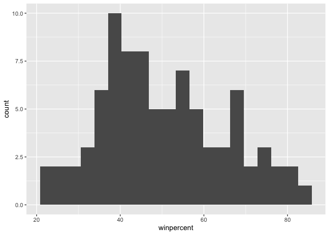
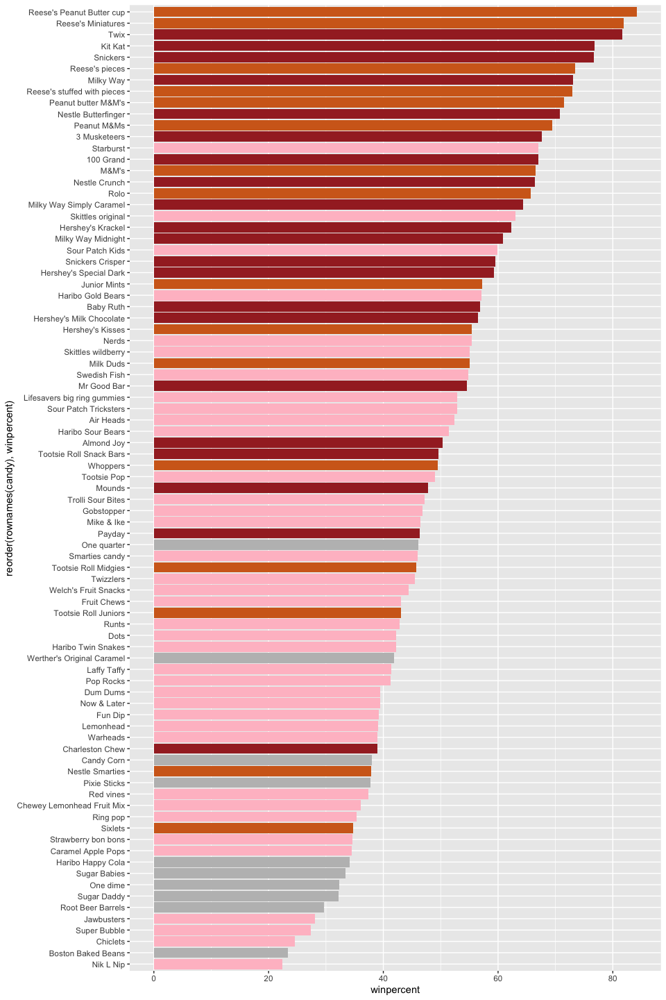
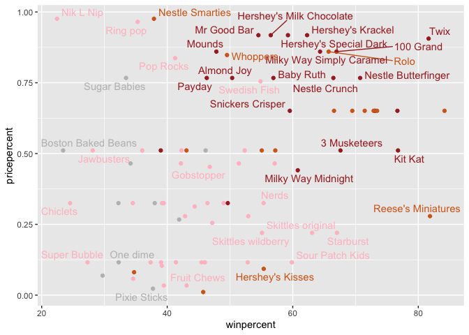
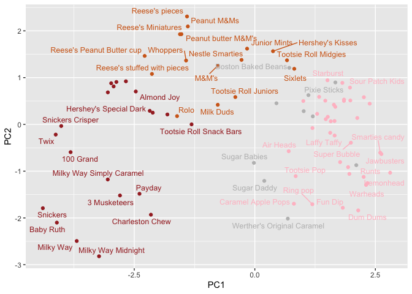

# Class 9: Candy Mini-Project
Dea Sinaga (PID: A17725676)

- [Background](#background)
- [Importing candy data](#importing-candy-data)
- [Exploratory analysis](#exploratory-analysis)
- [Overall Candy Rankings](#overall-candy-rankings)
- [Taking a look at pricepercent](#taking-a-look-at-pricepercent)
- [Exploring the correlation
  structure](#exploring-the-correlation-structure)
- [Principal Component Analysis](#principal-component-analysis)
- [Summary](#summary)

## Background

Today we are taking a detour to analyze a fun dataset (that we have more
intrinsic insight into) with the most useful analysis method we have
learned thus far - Principal Component Analysis (PCA).

## Importing candy data

The data is all realted to Halloween candy and is from the 538 website.

``` r
candy <- read.csv("candy-data.txt", row.names = 1)
head(candy)
```

                 chocolate fruity caramel peanutyalmondy nougat crispedricewafer
    100 Grand            1      0       1              0      0                1
    3 Musketeers         1      0       0              0      1                0
    One dime             0      0       0              0      0                0
    One quarter          0      0       0              0      0                0
    Air Heads            0      1       0              0      0                0
    Almond Joy           1      0       0              1      0                0
                 hard bar pluribus sugarpercent pricepercent winpercent
    100 Grand       0   1        0        0.732        0.860   66.97173
    3 Musketeers    0   1        0        0.604        0.511   67.60294
    One dime        0   0        0        0.011        0.116   32.26109
    One quarter     0   0        0        0.011        0.511   46.11650
    Air Heads       0   0        0        0.906        0.511   52.34146
    Almond Joy      0   1        0        0.465        0.767   50.34755

> **Q1.** How many different candy types are in this dataset?

``` r
nrow(candy)
```

    [1] 85

85 different candy types are in the dataset.

> **Q2.** How many fruity candy types are in the dataset?

``` r
sum(candy$fruity)
```

    [1] 38

There are 38 fruity candy types.

> **Q3.** What is your favorite candy (other than Twix) in the dataset
> and what is it’s winpercent value?

``` r
library(dplyr)
```


    Attaching package: 'dplyr'

    The following objects are masked from 'package:stats':

        filter, lag

    The following objects are masked from 'package:base':

        intersect, setdiff, setequal, union

``` r
candy %>%
  filter(row.names(candy)=="Milky Way") |> 
  select(winpercent)
```

              winpercent
    Milky Way   73.09956

The winpercent value of “Milky Way” is 73.09956.

> **Q4.** What is the winpercent value for “Kit Kat”?

``` r
candy %>%
  filter(row.names(candy)=="Kit Kat") |> 
  select(winpercent)
```

            winpercent
    Kit Kat    76.7686

The winpercent value is 76.7686.

> **Q5.** What is the winpercent value for “Tootsie Roll Snack Bars”?

``` r
candy %>%
  filter(row.names(candy)=="Tootsie Roll Snack Bars") |> 
  select(winpercent)
```

                            winpercent
    Tootsie Roll Snack Bars    49.6535

The winpercent value is 49.6535.

There is a useful ‘skim()’ function in the **skimr** package that can
help give you a quick overview of a given dataset. Let’s install this
package and try it on our candy data.

``` r
library(skimr)
skim(candy)
```

|                                                  |       |
|:-------------------------------------------------|:------|
| Name                                             | candy |
| Number of rows                                   | 85    |
| Number of columns                                | 12    |
| \_\_\_\_\_\_\_\_\_\_\_\_\_\_\_\_\_\_\_\_\_\_\_   |       |
| Column type frequency:                           |       |
| numeric                                          | 12    |
| \_\_\_\_\_\_\_\_\_\_\_\_\_\_\_\_\_\_\_\_\_\_\_\_ |       |
| Group variables                                  | None  |

Data summary

**Variable type: numeric**

| skim_variable | n_missing | complete_rate | mean | sd | p0 | p25 | p50 | p75 | p100 | hist |
|:---|---:|---:|---:|---:|---:|---:|---:|---:|---:|:---|
| chocolate | 0 | 1 | 0.44 | 0.50 | 0.00 | 0.00 | 0.00 | 1.00 | 1.00 | ▇▁▁▁▆ |
| fruity | 0 | 1 | 0.45 | 0.50 | 0.00 | 0.00 | 0.00 | 1.00 | 1.00 | ▇▁▁▁▆ |
| caramel | 0 | 1 | 0.16 | 0.37 | 0.00 | 0.00 | 0.00 | 0.00 | 1.00 | ▇▁▁▁▂ |
| peanutyalmondy | 0 | 1 | 0.16 | 0.37 | 0.00 | 0.00 | 0.00 | 0.00 | 1.00 | ▇▁▁▁▂ |
| nougat | 0 | 1 | 0.08 | 0.28 | 0.00 | 0.00 | 0.00 | 0.00 | 1.00 | ▇▁▁▁▁ |
| crispedricewafer | 0 | 1 | 0.08 | 0.28 | 0.00 | 0.00 | 0.00 | 0.00 | 1.00 | ▇▁▁▁▁ |
| hard | 0 | 1 | 0.18 | 0.38 | 0.00 | 0.00 | 0.00 | 0.00 | 1.00 | ▇▁▁▁▂ |
| bar | 0 | 1 | 0.25 | 0.43 | 0.00 | 0.00 | 0.00 | 0.00 | 1.00 | ▇▁▁▁▂ |
| pluribus | 0 | 1 | 0.52 | 0.50 | 0.00 | 0.00 | 1.00 | 1.00 | 1.00 | ▇▁▁▁▇ |
| sugarpercent | 0 | 1 | 0.48 | 0.28 | 0.01 | 0.22 | 0.47 | 0.73 | 0.99 | ▇▇▇▇▆ |
| pricepercent | 0 | 1 | 0.47 | 0.29 | 0.01 | 0.26 | 0.47 | 0.65 | 0.98 | ▇▇▇▇▆ |
| winpercent | 0 | 1 | 50.32 | 14.71 | 22.45 | 39.14 | 47.83 | 59.86 | 84.18 | ▃▇▆▅▂ |

> **Q6.** Is there any variable/column that looks to be on a different
> scale to the majority of the other columns in the dataset?

winpercent seems to be on a different scale.

> **Q7.** What do you think a zero and one represent for the
> candy\$chocolate column?

They represent whether the candy is chocolate or not. If the value is
zero, then it’s not chocolate. If the value is one, it is a chocolate.

## Exploratory analysis

> **Q8.** Plot a histogram of winpercent values using both base R and
> ggplot2.

``` r
hist(candy$winpercent)
```


``` r
library(ggplot2)

ggplot(candy) +
  aes(winpercent) +
  geom_histogram(bins = 20)
```



> **Q9.** Is the distribution of winpercent values symmetrical?

No

> **Q10.** Is the center of the distribution above or below 50%?

``` r
summary(candy$winpercent)
```

       Min. 1st Qu.  Median    Mean 3rd Qu.    Max. 
      22.45   39.14   47.83   50.32   59.86   84.18 

Below 50%

> **Q11.** On average is chocolate candy higher or lower ranked than
> fruit candy?

``` r
choc.ind <- as.logical(candy$chocolate)
choc.candy <- candy[choc.ind, ]
choc.win <- choc.candy$winpercent
mean(choc.win)
```

    [1] 60.92153

``` r
fruity.ind <- as.logical(candy$fruity)
fruity.candy <- candy[fruity.ind, ]
fruity.win <- fruity.candy$winpercent
mean(fruity.win)
```

    [1] 44.11974

Chocolate candy is ranked higher on average than fruity candy.

> **Q12.** Is this difference statistically significant?

``` r
t.test(choc.win, fruity.win)
```


        Welch Two Sample t-test

    data:  choc.win and fruity.win
    t = 6.2582, df = 68.882, p-value = 2.871e-08
    alternative hypothesis: true difference in means is not equal to 0
    95 percent confidence interval:
     11.44563 22.15795
    sample estimates:
    mean of x mean of y 
     60.92153  44.11974 

Yes, this difference is statistically significant.

## Overall Candy Rankings

> **Q13.** What are the five least liked candy types in this set?

``` r
x <- c(5, 10, 1)
sort(x)
```

    [1]  1  5 10

``` r
order(x)
```

    [1] 3 1 2

``` r
candy[order(candy$winpercent), ]
```

                                chocolate fruity caramel peanutyalmondy nougat
    Nik L Nip                           0      1       0              0      0
    Boston Baked Beans                  0      0       0              1      0
    Chiclets                            0      1       0              0      0
    Super Bubble                        0      1       0              0      0
    Jawbusters                          0      1       0              0      0
    Root Beer Barrels                   0      0       0              0      0
    Sugar Daddy                         0      0       1              0      0
    One dime                            0      0       0              0      0
    Sugar Babies                        0      0       1              0      0
    Haribo Happy Cola                   0      0       0              0      0
    Caramel Apple Pops                  0      1       1              0      0
    Strawberry bon bons                 0      1       0              0      0
    Sixlets                             1      0       0              0      0
    Ring pop                            0      1       0              0      0
    Chewey Lemonhead Fruit Mix          0      1       0              0      0
    Red vines                           0      1       0              0      0
    Pixie Sticks                        0      0       0              0      0
    Nestle Smarties                     1      0       0              0      0
    Candy Corn                          0      0       0              0      0
    Charleston Chew                     1      0       0              0      1
    Warheads                            0      1       0              0      0
    Lemonhead                           0      1       0              0      0
    Fun Dip                             0      1       0              0      0
    Now & Later                         0      1       0              0      0
    Dum Dums                            0      1       0              0      0
    Pop Rocks                           0      1       0              0      0
    Laffy Taffy                         0      1       0              0      0
    Werther's Original Caramel          0      0       1              0      0
    Haribo Twin Snakes                  0      1       0              0      0
    Dots                                0      1       0              0      0
    Runts                               0      1       0              0      0
    Tootsie Roll Juniors                1      0       0              0      0
    Fruit Chews                         0      1       0              0      0
    Welch's Fruit Snacks                0      1       0              0      0
    Twizzlers                           0      1       0              0      0
    Tootsie Roll Midgies                1      0       0              0      0
    Smarties candy                      0      1       0              0      0
    One quarter                         0      0       0              0      0
    Payday                              0      0       0              1      1
    Mike & Ike                          0      1       0              0      0
    Gobstopper                          0      1       0              0      0
    Trolli Sour Bites                   0      1       0              0      0
    Mounds                              1      0       0              0      0
    Tootsie Pop                         1      1       0              0      0
    Whoppers                            1      0       0              0      0
    Tootsie Roll Snack Bars             1      0       0              0      0
    Almond Joy                          1      0       0              1      0
    Haribo Sour Bears                   0      1       0              0      0
    Air Heads                           0      1       0              0      0
    Sour Patch Tricksters               0      1       0              0      0
    Lifesavers big ring gummies         0      1       0              0      0
    Mr Good Bar                         1      0       0              1      0
    Swedish Fish                        0      1       0              0      0
    Milk Duds                           1      0       1              0      0
    Skittles wildberry                  0      1       0              0      0
    Nerds                               0      1       0              0      0
    Hershey's Kisses                    1      0       0              0      0
    Hershey's Milk Chocolate            1      0       0              0      0
    Baby Ruth                           1      0       1              1      1
    Haribo Gold Bears                   0      1       0              0      0
    Junior Mints                        1      0       0              0      0
    Hershey's Special Dark              1      0       0              0      0
    Snickers Crisper                    1      0       1              1      0
    Sour Patch Kids                     0      1       0              0      0
    Milky Way Midnight                  1      0       1              0      1
    Hershey's Krackel                   1      0       0              0      0
    Skittles original                   0      1       0              0      0
    Milky Way Simply Caramel            1      0       1              0      0
    Rolo                                1      0       1              0      0
    Nestle Crunch                       1      0       0              0      0
    M&M's                               1      0       0              0      0
    100 Grand                           1      0       1              0      0
    Starburst                           0      1       0              0      0
    3 Musketeers                        1      0       0              0      1
    Peanut M&Ms                         1      0       0              1      0
    Nestle Butterfinger                 1      0       0              1      0
    Peanut butter M&M's                 1      0       0              1      0
    Reese's stuffed with pieces         1      0       0              1      0
    Milky Way                           1      0       1              0      1
    Reese's pieces                      1      0       0              1      0
    Snickers                            1      0       1              1      1
    Kit Kat                             1      0       0              0      0
    Twix                                1      0       1              0      0
    Reese's Miniatures                  1      0       0              1      0
    Reese's Peanut Butter cup           1      0       0              1      0
                                crispedricewafer hard bar pluribus sugarpercent
    Nik L Nip                                  0    0   0        1        0.197
    Boston Baked Beans                         0    0   0        1        0.313
    Chiclets                                   0    0   0        1        0.046
    Super Bubble                               0    0   0        0        0.162
    Jawbusters                                 0    1   0        1        0.093
    Root Beer Barrels                          0    1   0        1        0.732
    Sugar Daddy                                0    0   0        0        0.418
    One dime                                   0    0   0        0        0.011
    Sugar Babies                               0    0   0        1        0.965
    Haribo Happy Cola                          0    0   0        1        0.465
    Caramel Apple Pops                         0    0   0        0        0.604
    Strawberry bon bons                        0    1   0        1        0.569
    Sixlets                                    0    0   0        1        0.220
    Ring pop                                   0    1   0        0        0.732
    Chewey Lemonhead Fruit Mix                 0    0   0        1        0.732
    Red vines                                  0    0   0        1        0.581
    Pixie Sticks                               0    0   0        1        0.093
    Nestle Smarties                            0    0   0        1        0.267
    Candy Corn                                 0    0   0        1        0.906
    Charleston Chew                            0    0   1        0        0.604
    Warheads                                   0    1   0        0        0.093
    Lemonhead                                  0    1   0        0        0.046
    Fun Dip                                    0    1   0        0        0.732
    Now & Later                                0    0   0        1        0.220
    Dum Dums                                   0    1   0        0        0.732
    Pop Rocks                                  0    1   0        1        0.604
    Laffy Taffy                                0    0   0        0        0.220
    Werther's Original Caramel                 0    1   0        0        0.186
    Haribo Twin Snakes                         0    0   0        1        0.465
    Dots                                       0    0   0        1        0.732
    Runts                                      0    1   0        1        0.872
    Tootsie Roll Juniors                       0    0   0        0        0.313
    Fruit Chews                                0    0   0        1        0.127
    Welch's Fruit Snacks                       0    0   0        1        0.313
    Twizzlers                                  0    0   0        0        0.220
    Tootsie Roll Midgies                       0    0   0        1        0.174
    Smarties candy                             0    1   0        1        0.267
    One quarter                                0    0   0        0        0.011
    Payday                                     0    0   1        0        0.465
    Mike & Ike                                 0    0   0        1        0.872
    Gobstopper                                 0    1   0        1        0.906
    Trolli Sour Bites                          0    0   0        1        0.313
    Mounds                                     0    0   1        0        0.313
    Tootsie Pop                                0    1   0        0        0.604
    Whoppers                                   1    0   0        1        0.872
    Tootsie Roll Snack Bars                    0    0   1        0        0.465
    Almond Joy                                 0    0   1        0        0.465
    Haribo Sour Bears                          0    0   0        1        0.465
    Air Heads                                  0    0   0        0        0.906
    Sour Patch Tricksters                      0    0   0        1        0.069
    Lifesavers big ring gummies                0    0   0        0        0.267
    Mr Good Bar                                0    0   1        0        0.313
    Swedish Fish                               0    0   0        1        0.604
    Milk Duds                                  0    0   0        1        0.302
    Skittles wildberry                         0    0   0        1        0.941
    Nerds                                      0    1   0        1        0.848
    Hershey's Kisses                           0    0   0        1        0.127
    Hershey's Milk Chocolate                   0    0   1        0        0.430
    Baby Ruth                                  0    0   1        0        0.604
    Haribo Gold Bears                          0    0   0        1        0.465
    Junior Mints                               0    0   0        1        0.197
    Hershey's Special Dark                     0    0   1        0        0.430
    Snickers Crisper                           1    0   1        0        0.604
    Sour Patch Kids                            0    0   0        1        0.069
    Milky Way Midnight                         0    0   1        0        0.732
    Hershey's Krackel                          1    0   1        0        0.430
    Skittles original                          0    0   0        1        0.941
    Milky Way Simply Caramel                   0    0   1        0        0.965
    Rolo                                       0    0   0        1        0.860
    Nestle Crunch                              1    0   1        0        0.313
    M&M's                                      0    0   0        1        0.825
    100 Grand                                  1    0   1        0        0.732
    Starburst                                  0    0   0        1        0.151
    3 Musketeers                               0    0   1        0        0.604
    Peanut M&Ms                                0    0   0        1        0.593
    Nestle Butterfinger                        0    0   1        0        0.604
    Peanut butter M&M's                        0    0   0        1        0.825
    Reese's stuffed with pieces                0    0   0        0        0.988
    Milky Way                                  0    0   1        0        0.604
    Reese's pieces                             0    0   0        1        0.406
    Snickers                                   0    0   1        0        0.546
    Kit Kat                                    1    0   1        0        0.313
    Twix                                       1    0   1        0        0.546
    Reese's Miniatures                         0    0   0        0        0.034
    Reese's Peanut Butter cup                  0    0   0        0        0.720
                                pricepercent winpercent
    Nik L Nip                          0.976   22.44534
    Boston Baked Beans                 0.511   23.41782
    Chiclets                           0.325   24.52499
    Super Bubble                       0.116   27.30386
    Jawbusters                         0.511   28.12744
    Root Beer Barrels                  0.069   29.70369
    Sugar Daddy                        0.325   32.23100
    One dime                           0.116   32.26109
    Sugar Babies                       0.767   33.43755
    Haribo Happy Cola                  0.465   34.15896
    Caramel Apple Pops                 0.325   34.51768
    Strawberry bon bons                0.058   34.57899
    Sixlets                            0.081   34.72200
    Ring pop                           0.965   35.29076
    Chewey Lemonhead Fruit Mix         0.511   36.01763
    Red vines                          0.116   37.34852
    Pixie Sticks                       0.023   37.72234
    Nestle Smarties                    0.976   37.88719
    Candy Corn                         0.325   38.01096
    Charleston Chew                    0.511   38.97504
    Warheads                           0.116   39.01190
    Lemonhead                          0.104   39.14106
    Fun Dip                            0.325   39.18550
    Now & Later                        0.325   39.44680
    Dum Dums                           0.034   39.46056
    Pop Rocks                          0.837   41.26551
    Laffy Taffy                        0.116   41.38956
    Werther's Original Caramel         0.267   41.90431
    Haribo Twin Snakes                 0.465   42.17877
    Dots                               0.511   42.27208
    Runts                              0.279   42.84914
    Tootsie Roll Juniors               0.511   43.06890
    Fruit Chews                        0.034   43.08892
    Welch's Fruit Snacks               0.313   44.37552
    Twizzlers                          0.116   45.46628
    Tootsie Roll Midgies               0.011   45.73675
    Smarties candy                     0.116   45.99583
    One quarter                        0.511   46.11650
    Payday                             0.767   46.29660
    Mike & Ike                         0.325   46.41172
    Gobstopper                         0.453   46.78335
    Trolli Sour Bites                  0.255   47.17323
    Mounds                             0.860   47.82975
    Tootsie Pop                        0.325   48.98265
    Whoppers                           0.848   49.52411
    Tootsie Roll Snack Bars            0.325   49.65350
    Almond Joy                         0.767   50.34755
    Haribo Sour Bears                  0.465   51.41243
    Air Heads                          0.511   52.34146
    Sour Patch Tricksters              0.116   52.82595
    Lifesavers big ring gummies        0.279   52.91139
    Mr Good Bar                        0.918   54.52645
    Swedish Fish                       0.755   54.86111
    Milk Duds                          0.511   55.06407
    Skittles wildberry                 0.220   55.10370
    Nerds                              0.325   55.35405
    Hershey's Kisses                   0.093   55.37545
    Hershey's Milk Chocolate           0.918   56.49050
    Baby Ruth                          0.767   56.91455
    Haribo Gold Bears                  0.465   57.11974
    Junior Mints                       0.511   57.21925
    Hershey's Special Dark             0.918   59.23612
    Snickers Crisper                   0.651   59.52925
    Sour Patch Kids                    0.116   59.86400
    Milky Way Midnight                 0.441   60.80070
    Hershey's Krackel                  0.918   62.28448
    Skittles original                  0.220   63.08514
    Milky Way Simply Caramel           0.860   64.35334
    Rolo                               0.860   65.71629
    Nestle Crunch                      0.767   66.47068
    M&M's                              0.651   66.57458
    100 Grand                          0.860   66.97173
    Starburst                          0.220   67.03763
    3 Musketeers                       0.511   67.60294
    Peanut M&Ms                        0.651   69.48379
    Nestle Butterfinger                0.767   70.73564
    Peanut butter M&M's                0.651   71.46505
    Reese's stuffed with pieces        0.651   72.88790
    Milky Way                          0.651   73.09956
    Reese's pieces                     0.651   73.43499
    Snickers                           0.651   76.67378
    Kit Kat                            0.511   76.76860
    Twix                               0.906   81.64291
    Reese's Miniatures                 0.279   81.86626
    Reese's Peanut Butter cup          0.651   84.18029

Nik L Nip, Boston Baked Beans, Chiclets, Super Bubble, and Jawbuster.

> **Q14.** What are the top 5 all time favorite candy types out of this
> set?

``` r
candy[order(candy$winpercent, decreasing = TRUE), ]
```

                                chocolate fruity caramel peanutyalmondy nougat
    Reese's Peanut Butter cup           1      0       0              1      0
    Reese's Miniatures                  1      0       0              1      0
    Twix                                1      0       1              0      0
    Kit Kat                             1      0       0              0      0
    Snickers                            1      0       1              1      1
    Reese's pieces                      1      0       0              1      0
    Milky Way                           1      0       1              0      1
    Reese's stuffed with pieces         1      0       0              1      0
    Peanut butter M&M's                 1      0       0              1      0
    Nestle Butterfinger                 1      0       0              1      0
    Peanut M&Ms                         1      0       0              1      0
    3 Musketeers                        1      0       0              0      1
    Starburst                           0      1       0              0      0
    100 Grand                           1      0       1              0      0
    M&M's                               1      0       0              0      0
    Nestle Crunch                       1      0       0              0      0
    Rolo                                1      0       1              0      0
    Milky Way Simply Caramel            1      0       1              0      0
    Skittles original                   0      1       0              0      0
    Hershey's Krackel                   1      0       0              0      0
    Milky Way Midnight                  1      0       1              0      1
    Sour Patch Kids                     0      1       0              0      0
    Snickers Crisper                    1      0       1              1      0
    Hershey's Special Dark              1      0       0              0      0
    Junior Mints                        1      0       0              0      0
    Haribo Gold Bears                   0      1       0              0      0
    Baby Ruth                           1      0       1              1      1
    Hershey's Milk Chocolate            1      0       0              0      0
    Hershey's Kisses                    1      0       0              0      0
    Nerds                               0      1       0              0      0
    Skittles wildberry                  0      1       0              0      0
    Milk Duds                           1      0       1              0      0
    Swedish Fish                        0      1       0              0      0
    Mr Good Bar                         1      0       0              1      0
    Lifesavers big ring gummies         0      1       0              0      0
    Sour Patch Tricksters               0      1       0              0      0
    Air Heads                           0      1       0              0      0
    Haribo Sour Bears                   0      1       0              0      0
    Almond Joy                          1      0       0              1      0
    Tootsie Roll Snack Bars             1      0       0              0      0
    Whoppers                            1      0       0              0      0
    Tootsie Pop                         1      1       0              0      0
    Mounds                              1      0       0              0      0
    Trolli Sour Bites                   0      1       0              0      0
    Gobstopper                          0      1       0              0      0
    Mike & Ike                          0      1       0              0      0
    Payday                              0      0       0              1      1
    One quarter                         0      0       0              0      0
    Smarties candy                      0      1       0              0      0
    Tootsie Roll Midgies                1      0       0              0      0
    Twizzlers                           0      1       0              0      0
    Welch's Fruit Snacks                0      1       0              0      0
    Fruit Chews                         0      1       0              0      0
    Tootsie Roll Juniors                1      0       0              0      0
    Runts                               0      1       0              0      0
    Dots                                0      1       0              0      0
    Haribo Twin Snakes                  0      1       0              0      0
    Werther's Original Caramel          0      0       1              0      0
    Laffy Taffy                         0      1       0              0      0
    Pop Rocks                           0      1       0              0      0
    Dum Dums                            0      1       0              0      0
    Now & Later                         0      1       0              0      0
    Fun Dip                             0      1       0              0      0
    Lemonhead                           0      1       0              0      0
    Warheads                            0      1       0              0      0
    Charleston Chew                     1      0       0              0      1
    Candy Corn                          0      0       0              0      0
    Nestle Smarties                     1      0       0              0      0
    Pixie Sticks                        0      0       0              0      0
    Red vines                           0      1       0              0      0
    Chewey Lemonhead Fruit Mix          0      1       0              0      0
    Ring pop                            0      1       0              0      0
    Sixlets                             1      0       0              0      0
    Strawberry bon bons                 0      1       0              0      0
    Caramel Apple Pops                  0      1       1              0      0
    Haribo Happy Cola                   0      0       0              0      0
    Sugar Babies                        0      0       1              0      0
    One dime                            0      0       0              0      0
    Sugar Daddy                         0      0       1              0      0
    Root Beer Barrels                   0      0       0              0      0
    Jawbusters                          0      1       0              0      0
    Super Bubble                        0      1       0              0      0
    Chiclets                            0      1       0              0      0
    Boston Baked Beans                  0      0       0              1      0
    Nik L Nip                           0      1       0              0      0
                                crispedricewafer hard bar pluribus sugarpercent
    Reese's Peanut Butter cup                  0    0   0        0        0.720
    Reese's Miniatures                         0    0   0        0        0.034
    Twix                                       1    0   1        0        0.546
    Kit Kat                                    1    0   1        0        0.313
    Snickers                                   0    0   1        0        0.546
    Reese's pieces                             0    0   0        1        0.406
    Milky Way                                  0    0   1        0        0.604
    Reese's stuffed with pieces                0    0   0        0        0.988
    Peanut butter M&M's                        0    0   0        1        0.825
    Nestle Butterfinger                        0    0   1        0        0.604
    Peanut M&Ms                                0    0   0        1        0.593
    3 Musketeers                               0    0   1        0        0.604
    Starburst                                  0    0   0        1        0.151
    100 Grand                                  1    0   1        0        0.732
    M&M's                                      0    0   0        1        0.825
    Nestle Crunch                              1    0   1        0        0.313
    Rolo                                       0    0   0        1        0.860
    Milky Way Simply Caramel                   0    0   1        0        0.965
    Skittles original                          0    0   0        1        0.941
    Hershey's Krackel                          1    0   1        0        0.430
    Milky Way Midnight                         0    0   1        0        0.732
    Sour Patch Kids                            0    0   0        1        0.069
    Snickers Crisper                           1    0   1        0        0.604
    Hershey's Special Dark                     0    0   1        0        0.430
    Junior Mints                               0    0   0        1        0.197
    Haribo Gold Bears                          0    0   0        1        0.465
    Baby Ruth                                  0    0   1        0        0.604
    Hershey's Milk Chocolate                   0    0   1        0        0.430
    Hershey's Kisses                           0    0   0        1        0.127
    Nerds                                      0    1   0        1        0.848
    Skittles wildberry                         0    0   0        1        0.941
    Milk Duds                                  0    0   0        1        0.302
    Swedish Fish                               0    0   0        1        0.604
    Mr Good Bar                                0    0   1        0        0.313
    Lifesavers big ring gummies                0    0   0        0        0.267
    Sour Patch Tricksters                      0    0   0        1        0.069
    Air Heads                                  0    0   0        0        0.906
    Haribo Sour Bears                          0    0   0        1        0.465
    Almond Joy                                 0    0   1        0        0.465
    Tootsie Roll Snack Bars                    0    0   1        0        0.465
    Whoppers                                   1    0   0        1        0.872
    Tootsie Pop                                0    1   0        0        0.604
    Mounds                                     0    0   1        0        0.313
    Trolli Sour Bites                          0    0   0        1        0.313
    Gobstopper                                 0    1   0        1        0.906
    Mike & Ike                                 0    0   0        1        0.872
    Payday                                     0    0   1        0        0.465
    One quarter                                0    0   0        0        0.011
    Smarties candy                             0    1   0        1        0.267
    Tootsie Roll Midgies                       0    0   0        1        0.174
    Twizzlers                                  0    0   0        0        0.220
    Welch's Fruit Snacks                       0    0   0        1        0.313
    Fruit Chews                                0    0   0        1        0.127
    Tootsie Roll Juniors                       0    0   0        0        0.313
    Runts                                      0    1   0        1        0.872
    Dots                                       0    0   0        1        0.732
    Haribo Twin Snakes                         0    0   0        1        0.465
    Werther's Original Caramel                 0    1   0        0        0.186
    Laffy Taffy                                0    0   0        0        0.220
    Pop Rocks                                  0    1   0        1        0.604
    Dum Dums                                   0    1   0        0        0.732
    Now & Later                                0    0   0        1        0.220
    Fun Dip                                    0    1   0        0        0.732
    Lemonhead                                  0    1   0        0        0.046
    Warheads                                   0    1   0        0        0.093
    Charleston Chew                            0    0   1        0        0.604
    Candy Corn                                 0    0   0        1        0.906
    Nestle Smarties                            0    0   0        1        0.267
    Pixie Sticks                               0    0   0        1        0.093
    Red vines                                  0    0   0        1        0.581
    Chewey Lemonhead Fruit Mix                 0    0   0        1        0.732
    Ring pop                                   0    1   0        0        0.732
    Sixlets                                    0    0   0        1        0.220
    Strawberry bon bons                        0    1   0        1        0.569
    Caramel Apple Pops                         0    0   0        0        0.604
    Haribo Happy Cola                          0    0   0        1        0.465
    Sugar Babies                               0    0   0        1        0.965
    One dime                                   0    0   0        0        0.011
    Sugar Daddy                                0    0   0        0        0.418
    Root Beer Barrels                          0    1   0        1        0.732
    Jawbusters                                 0    1   0        1        0.093
    Super Bubble                               0    0   0        0        0.162
    Chiclets                                   0    0   0        1        0.046
    Boston Baked Beans                         0    0   0        1        0.313
    Nik L Nip                                  0    0   0        1        0.197
                                pricepercent winpercent
    Reese's Peanut Butter cup          0.651   84.18029
    Reese's Miniatures                 0.279   81.86626
    Twix                               0.906   81.64291
    Kit Kat                            0.511   76.76860
    Snickers                           0.651   76.67378
    Reese's pieces                     0.651   73.43499
    Milky Way                          0.651   73.09956
    Reese's stuffed with pieces        0.651   72.88790
    Peanut butter M&M's                0.651   71.46505
    Nestle Butterfinger                0.767   70.73564
    Peanut M&Ms                        0.651   69.48379
    3 Musketeers                       0.511   67.60294
    Starburst                          0.220   67.03763
    100 Grand                          0.860   66.97173
    M&M's                              0.651   66.57458
    Nestle Crunch                      0.767   66.47068
    Rolo                               0.860   65.71629
    Milky Way Simply Caramel           0.860   64.35334
    Skittles original                  0.220   63.08514
    Hershey's Krackel                  0.918   62.28448
    Milky Way Midnight                 0.441   60.80070
    Sour Patch Kids                    0.116   59.86400
    Snickers Crisper                   0.651   59.52925
    Hershey's Special Dark             0.918   59.23612
    Junior Mints                       0.511   57.21925
    Haribo Gold Bears                  0.465   57.11974
    Baby Ruth                          0.767   56.91455
    Hershey's Milk Chocolate           0.918   56.49050
    Hershey's Kisses                   0.093   55.37545
    Nerds                              0.325   55.35405
    Skittles wildberry                 0.220   55.10370
    Milk Duds                          0.511   55.06407
    Swedish Fish                       0.755   54.86111
    Mr Good Bar                        0.918   54.52645
    Lifesavers big ring gummies        0.279   52.91139
    Sour Patch Tricksters              0.116   52.82595
    Air Heads                          0.511   52.34146
    Haribo Sour Bears                  0.465   51.41243
    Almond Joy                         0.767   50.34755
    Tootsie Roll Snack Bars            0.325   49.65350
    Whoppers                           0.848   49.52411
    Tootsie Pop                        0.325   48.98265
    Mounds                             0.860   47.82975
    Trolli Sour Bites                  0.255   47.17323
    Gobstopper                         0.453   46.78335
    Mike & Ike                         0.325   46.41172
    Payday                             0.767   46.29660
    One quarter                        0.511   46.11650
    Smarties candy                     0.116   45.99583
    Tootsie Roll Midgies               0.011   45.73675
    Twizzlers                          0.116   45.46628
    Welch's Fruit Snacks               0.313   44.37552
    Fruit Chews                        0.034   43.08892
    Tootsie Roll Juniors               0.511   43.06890
    Runts                              0.279   42.84914
    Dots                               0.511   42.27208
    Haribo Twin Snakes                 0.465   42.17877
    Werther's Original Caramel         0.267   41.90431
    Laffy Taffy                        0.116   41.38956
    Pop Rocks                          0.837   41.26551
    Dum Dums                           0.034   39.46056
    Now & Later                        0.325   39.44680
    Fun Dip                            0.325   39.18550
    Lemonhead                          0.104   39.14106
    Warheads                           0.116   39.01190
    Charleston Chew                    0.511   38.97504
    Candy Corn                         0.325   38.01096
    Nestle Smarties                    0.976   37.88719
    Pixie Sticks                       0.023   37.72234
    Red vines                          0.116   37.34852
    Chewey Lemonhead Fruit Mix         0.511   36.01763
    Ring pop                           0.965   35.29076
    Sixlets                            0.081   34.72200
    Strawberry bon bons                0.058   34.57899
    Caramel Apple Pops                 0.325   34.51768
    Haribo Happy Cola                  0.465   34.15896
    Sugar Babies                       0.767   33.43755
    One dime                           0.116   32.26109
    Sugar Daddy                        0.325   32.23100
    Root Beer Barrels                  0.069   29.70369
    Jawbusters                         0.511   28.12744
    Super Bubble                       0.116   27.30386
    Chiclets                           0.325   24.52499
    Boston Baked Beans                 0.511   23.41782
    Nik L Nip                          0.976   22.44534

Reese’s Peanut Butter Cup, Reese’s Miniatures, Twix, Kit Kat, and
Snickers.

> **Q15.** Make a first barplot of candy ranking based on winpercent
> values.

``` r
ggplot(candy) +
  aes(winpercent, rownames(candy)) +
  geom_col()
```


> **Q16.** This is quite ugly, use the reorder() function to get the
> bars sorted by winpercent?

``` r
ggplot(candy) +
  aes(winpercent, reorder(rownames(candy), winpercent)) +
  geom_col()
```


> **Q17.** What is the worst ranked chocolate candy?

``` r
mycols <- rep("gray", nrow(candy)) 

## chocolate candy in chocolate color
mycols[as.logical(candy$chocolate)] <- "chocolate"
## candy bars in brown
mycols[as.logical(candy$bar)] <- "brown"
## fruity candy in pink
mycols[as.logical(candy$fruity)] <- "pink"

ggplot(candy) +
  aes(winpercent,
      reorder(rownames(candy), winpercent)) +
        geom_col(fill=mycols)
```



Sixlets is the worst ranked chocolate candy.

> **Q18.** What is the best ranked fruity candy?

Starburst is the best ranked fruity candy.

## Taking a look at pricepercent

Make a plot of winprcent vs pricepercent

``` r
library(ggrepel)

ggplot(candy) +
  aes(winpercent, 
      pricepercent, 
      label=rownames(candy)) +
  geom_point(col=mycols) +
  geom_text_repel(col=mycols, max.overlaps=7)
```



> **Q19.** Which candy type is the highest ranked in terms of winpercent
> for the least money - i.e. offers the most bang for your buck?

Based on the figure above, “Reese’s Miniatures” is the highest ranked in
terms of winpercent for the least money.

> **Q20.** What are the top 5 most expensive candy types in the dataset
> and of these which is the least popular?

From the figure, I can tell that Nik L Nip, Nestle Smarties, and Ring
pop are the most expensive. I can’t clearly tell which ones are the next
most expensive out of these: Mr Good Bar, Hershey’s Milk Chocolate,
Hershey’s Special Dark, or Hershey’s Krackel. Out of those, Nik L Nip is
the least popular.

## Exploring the correlation structure

We can calculate the pair-wise correlation of all our columns.

``` r
cij <- cor(candy)
cij
```

                      chocolate      fruity     caramel peanutyalmondy      nougat
    chocolate         1.0000000 -0.74172106  0.24987535     0.37782357  0.25489183
    fruity           -0.7417211  1.00000000 -0.33548538    -0.39928014 -0.26936712
    caramel           0.2498753 -0.33548538  1.00000000     0.05935614  0.32849280
    peanutyalmondy    0.3778236 -0.39928014  0.05935614     1.00000000  0.21311310
    nougat            0.2548918 -0.26936712  0.32849280     0.21311310  1.00000000
    crispedricewafer  0.3412098 -0.26936712  0.21311310    -0.01764631 -0.08974359
    hard             -0.3441769  0.39067750 -0.12235513    -0.20555661 -0.13867505
    bar               0.5974211 -0.51506558  0.33396002     0.26041960  0.52297636
    pluribus         -0.3396752  0.29972522 -0.26958501    -0.20610932 -0.31033884
    sugarpercent      0.1041691 -0.03439296  0.22193335     0.08788927  0.12308135
    pricepercent      0.5046754 -0.43096853  0.25432709     0.30915323  0.15319643
    winpercent        0.6365167 -0.38093814  0.21341630     0.40619220  0.19937530
                     crispedricewafer        hard         bar    pluribus
    chocolate              0.34120978 -0.34417691  0.59742114 -0.33967519
    fruity                -0.26936712  0.39067750 -0.51506558  0.29972522
    caramel                0.21311310 -0.12235513  0.33396002 -0.26958501
    peanutyalmondy        -0.01764631 -0.20555661  0.26041960 -0.20610932
    nougat                -0.08974359 -0.13867505  0.52297636 -0.31033884
    crispedricewafer       1.00000000 -0.13867505  0.42375093 -0.22469338
    hard                  -0.13867505  1.00000000 -0.26516504  0.01453172
    bar                    0.42375093 -0.26516504  1.00000000 -0.59340892
    pluribus              -0.22469338  0.01453172 -0.59340892  1.00000000
    sugarpercent           0.06994969  0.09180975  0.09998516  0.04552282
    pricepercent           0.32826539 -0.24436534  0.51840654 -0.22079363
    winpercent             0.32467965 -0.31038158  0.42992933 -0.24744787
                     sugarpercent pricepercent winpercent
    chocolate          0.10416906    0.5046754  0.6365167
    fruity            -0.03439296   -0.4309685 -0.3809381
    caramel            0.22193335    0.2543271  0.2134163
    peanutyalmondy     0.08788927    0.3091532  0.4061922
    nougat             0.12308135    0.1531964  0.1993753
    crispedricewafer   0.06994969    0.3282654  0.3246797
    hard               0.09180975   -0.2443653 -0.3103816
    bar                0.09998516    0.5184065  0.4299293
    pluribus           0.04552282   -0.2207936 -0.2474479
    sugarpercent       1.00000000    0.3297064  0.2291507
    pricepercent       0.32970639    1.0000000  0.3453254
    winpercent         0.22915066    0.3453254  1.0000000

``` r
library(corrplot)
```

    corrplot 0.95 loaded

``` r
corrplot(cij)
```


> **Q22.** Examining this plot what two variables are anti-correlated
> (i.e. have minus values)?

Fruity and chocolate are anti-correlated.

> **Q23.** Use your corrplot result to make a prediction: which
> variables do you expect will have the largest contributions
> (i.e. loadings) to PC1 (i.e., drive the most separation between
> candies along the first principal component)?

I expect fruity and chocolate to have the largest contributions.

## Principal Component Analysis

In this case, we want to be sure to set ‘scale=TRUE’ argument for
‘prcomp()’ because we have one variable ‘winpercent’ that is on a very
different scale than all others and would otherwise dominate our PCA
results.

``` r
pca <- prcomp(candy, scale = TRUE)
summary(pca)
```

    Importance of components:
                              PC1    PC2    PC3     PC4    PC5     PC6     PC7
    Standard deviation     2.0788 1.1378 1.1092 1.07533 0.9518 0.81923 0.81530
    Proportion of Variance 0.3601 0.1079 0.1025 0.09636 0.0755 0.05593 0.05539
    Cumulative Proportion  0.3601 0.4680 0.5705 0.66688 0.7424 0.79830 0.85369
                               PC8     PC9    PC10    PC11    PC12
    Standard deviation     0.74530 0.67824 0.62349 0.43974 0.39760
    Proportion of Variance 0.04629 0.03833 0.03239 0.01611 0.01317
    Cumulative Proportion  0.89998 0.93832 0.97071 0.98683 1.00000

First major result figure is the “score plot” of PC1 and PC2 – how
different candy are related to each other on our new PC axis:

``` r
ggplot(pca$x) +
  aes(PC1, PC2, label=row.names(pca$x)) +
  geom_point(col=mycols) +
  geom_text_repel(size=3.3, col=mycols, max.overlaps=7)
```



> **Q24.** Complete the code to generate the loadings plot above. What
> original variables are picked up strongly by PC1 in the positive
> direction? Do these make sense to you? Where did you see this
> relationship highlighted previously?

The second major results figure from PCA.

``` r
ggplot(pca$rotation) +
  aes(PC1, 
      reorder(row.names(pca$rotation), PC1)) + 
      geom_col()
```


Fruity, pluribus, and hard are picked up strongly by PC1 in the positive
direction. It makes sense as in the previous figure, fruity candies are
on the far right (positive direction) of PC1.

## Summary

> **Q25.** Based on your exploratory analysis, correlation findings, and
> PCA results, what combination of characteristics appears to make a
> “winning” candy? How do these different analyses (visualization,
> correlation, PCA) support or complement each other in reaching this
> conclusion?

The characteristics that appear to make a “winning” candy are chocolate
and bar, not fruity candies. The visualization figure shows that they
are the highest ranked candies. The correlation plot shows that
chocolate and fruity are negatively correlated with each other. The PCA
plot shows that chocolate and fruity candies tend to be on opposite
sides of PC1.
