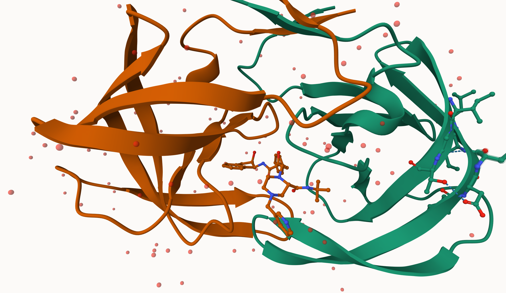
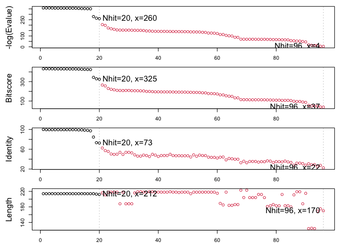
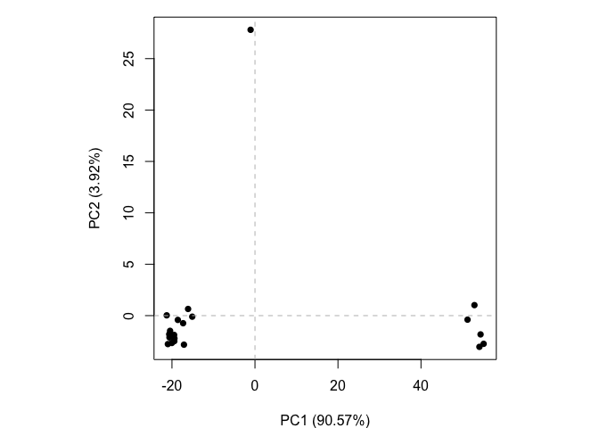

# Class 10: Structural Bioinformatics (Pt. 1)
Dea Sinaga (PID: A17725676)

- [Background](#background)
- [PDB statistics](#pdb-statistics)
- [Visualizing PDB data with
  Mol-star](#visualizing-pdb-data-with-mol-star)
- [Getting started with the Bio3D
  package](#getting-started-with-the-bio3d-package)
  - [Predict the flexibility of a given
    structure](#predict-the-flexibility-of-a-given-structure)
  - [Comparative analysis of the ADK
    family](#comparative-analysis-of-the-adk-family)

## Background

The main repository of high-resolution structural data on biomolecules
is called the **Protein Data Bank** (PDB).

## PDB statistics

What is in the PDB in terms of molecule type and structure determination
method?

Read a CSV file of current PDB stats obtained from
https://www.rcsb.org/stats/summary

``` r
pdb <- read.csv("Data Export Summary.csv")
pdb
```

               Molecular.Type   X.ray     EM    NMR Integrative Multiple.methods
    1          Protein (only) 180,758 23,111 12,813         348              229
    2 Protein/Oligosaccharide  10,488  3,741     34           8               11
    3              Protein/NA   9,205  6,751    287          26                8
    4     Nucleic acid (only)   3,154    250  1,578           3               15
    5                   Other     178     27     35           4                0
    6  Oligosaccharide (only)      11      0      6           0                1
      Neutron Other   Total
    1      84    32 217,375
    2       1     0  14,283
    3       0     0  16,277
    4       3     1   5,004
    5       0     0     244
    6       0     4      22

> **Q1**: What percentage of structures in the PDB are solved by X-Ray
> and Electron Microscopy.

``` r
pdb$X.ray
```

    [1] "180,758" "10,488"  "9,205"   "3,154"   "178"     "11"     

This print out above ‘pdb\$X.ray’ is “character”, not “numeric”.
Therefore, I can’t do math with it. We need to fix this…

Two functions that can help here are ‘sub()’ and

``` r
# We want to get rid (or sub out) commas: 
x <- pdb$X.ray
tmp <- sub(",", "", x)
sum(as.numeric(tmp))
```

    [1] 203794

We could make a function to do this:

``` r
rm.comma <- function(x) {
  tmp <- sub(",", "", x)
  sum(as.numeric(tmp))
}
```

``` r
rm.comma(pdb$'X-ray')
```

    [1] 0

``` r
rm.comma(pdb$EM)
```

    [1] 33880

We could also use a different input function for this CSV that speaks
American (i.e. deals with commas in numbers in a comma separated value
file)

``` r
library(readr)

read_csv("Data Export Summary.csv")
```

    Rows: 6 Columns: 9
    ── Column specification ────────────────────────────────────────────────────────
    Delimiter: ","
    chr (1): Molecular Type
    dbl (4): Integrative, Multiple methods, Neutron, Other
    num (4): X-ray, EM, NMR, Total

    ℹ Use `spec()` to retrieve the full column specification for this data.
    ℹ Specify the column types or set `show_col_types = FALSE` to quiet this message.

    # A tibble: 6 × 9
      `Molecular Type`    `X-ray`    EM   NMR Integrative `Multiple methods` Neutron
      <chr>                 <dbl> <dbl> <dbl>       <dbl>              <dbl>   <dbl>
    1 Protein (only)       180758 23111 12813         348                229      84
    2 Protein/Oligosacch…   10488  3741    34           8                 11       1
    3 Protein/NA             9205  6751   287          26                  8       0
    4 Nucleic acid (only)    3154   250  1578           3                 15       3
    5 Other                   178    27    35           4                  0       0
    6 Oligosaccharide (o…      11     0     6           0                  1       0
    # ℹ 2 more variables: Other <dbl>, Total <dbl>

``` r
n.tot <- rm.comma(pdb$Total)
n.xray <- rm.comma(pdb$'X-ray')
n.em <- rm.comma(pdb$EM)

n.xray / n.tot * 100
```

    [1] 0

``` r
n.em / n.tot * 100
```

    [1] 13.38046

> How many total protein structures are there

``` r
pdb$Total[1]
```

    [1] "217,375"

The total number of protein sequences in UniProt is 202,556,314.

``` r
217375/202556314 * 100
```

    [1] 0.1073158

> **Key point**: We have a very, very small structural coverage of known
> proteins (~0.1%). Most structures we know about (~80%) come from one
> method (X-ray).

## Visualizing PDB data with Mol-star

Main stand alone web version with all features is at
https://molstar.org/viewer/




# Getting started with the Bio3D package

Bio3D is an R package fro CRAN for structural bioinformatics

``` r
library(bio3d)

pdb <- read.pdb("1hsg")
```

      Note: Accessing on-line PDB file

``` r
pdb
```


     Call:  read.pdb(file = "1hsg")

       Total Models#: 1
         Total Atoms#: 1686,  XYZs#: 5058  Chains#: 2  (values: A B)

         Protein Atoms#: 1514  (residues/Calpha atoms#: 198)
         Nucleic acid Atoms#: 0  (residues/phosphate atoms#: 0)

         Non-protein/nucleic Atoms#: 172  (residues: 128)
         Non-protein/nucleic resid values: [ HOH (127), MK1 (1) ]

       Protein sequence:
          PQITLWQRPLVTIKIGGQLKEALLDTGADDTVLEEMSLPGRWKPKMIGGIGGFIKVRQYD
          QILIEICGHKAIGTVLVGPTPVNIIGRNLLTQIGCTLNFPQITLWQRPLVTIKIGGQLKE
          ALLDTGADDTVLEEMSLPGRWKPKMIGGIGGFIKVRQYDQILIEICGHKAIGTVLVGPTP
          VNIIGRNLLTQIGCTLNF

    + attr: atom, xyz, seqres, helix, sheet,
            calpha, remark, call

``` r
head(pdb$atom)
```

      type eleno elety  alt resid chain resno insert      x      y     z o     b
    1 ATOM     1     N <NA>   PRO     A     1   <NA> 29.361 39.686 5.862 1 38.10
    2 ATOM     2    CA <NA>   PRO     A     1   <NA> 30.307 38.663 5.319 1 40.62
    3 ATOM     3     C <NA>   PRO     A     1   <NA> 29.760 38.071 4.022 1 42.64
    4 ATOM     4     O <NA>   PRO     A     1   <NA> 28.600 38.302 3.676 1 43.40
    5 ATOM     5    CB <NA>   PRO     A     1   <NA> 30.508 37.541 6.342 1 37.87
    6 ATOM     6    CG <NA>   PRO     A     1   <NA> 29.296 37.591 7.162 1 38.40
      segid elesy charge
    1  <NA>     N   <NA>
    2  <NA>     C   <NA>
    3  <NA>     C   <NA>
    4  <NA>     O   <NA>
    5  <NA>     C   <NA>
    6  <NA>     C   <NA>

There are lots of functions that can work with these ‘pdb’ objects:

``` r
head(pdbseq(pdb))
```

      1   2   3   4   5   6 
    "P" "Q" "I" "T" "L" "W" 

We can have a quick interactive view of any of these ‘pdb’ objects:

``` r
library(bio3dview)

view.pdb(pdb)
```

Let’s try a custom view.

``` r
view.pdb(pdb, colorScheme="sse", backgroundColor="black")
```

> Q. Create a custom view of HIV-Pr highlighting the active site ASP
> (‘resno=25’), the two chains (in your choice of colors), and the
> ligand all on a custom color background.

``` r
active.site <- atom.select(pdb, resno=25)

library(NGLVieweR)

view.pdb(pdb, 
         cols <- c("red", "blue"),
         highlight = active.site, 
         backgroundColor = "pink",
         highlight.style = "spacefill") |>
  setRock()
```

## Predict the flexibility of a given structure

Let’s do a Normal Mode Analysis (NMA) to predict the flexibility of a
given ‘pdb’ object:

``` r
adk <- read.pdb("6s36")
```

      Note: Accessing on-line PDB file
       PDB has ALT records, taking A only, rm.alt=TRUE

A quick structure summary

``` r
adk
```


     Call:  read.pdb(file = "6s36")

       Total Models#: 1
         Total Atoms#: 1898,  XYZs#: 5694  Chains#: 1  (values: A)

         Protein Atoms#: 1654  (residues/Calpha atoms#: 214)
         Nucleic acid Atoms#: 0  (residues/phosphate atoms#: 0)

         Non-protein/nucleic Atoms#: 244  (residues: 244)
         Non-protein/nucleic resid values: [ CL (3), HOH (238), MG (2), NA (1) ]

       Protein sequence:
          MRIILLGAPGAGKGTQAQFIMEKYGIPQISTGDMLRAAVKSGSELGKQAKDIMDAGKLVT
          DELVIALVKERIAQEDCRNGFLLDGFPRTIPQADAMKEAGINVDYVLEFDVPDELIVDKI
          VGRRVHAPSGRVYHVKFNPPKVEGKDDVTGEELTTRKDDQEETVRKRLVEYHQMTAPLIG
          YYSKEAEAGNTKYAKVDGTKPVAEVRADLEKILG

    + attr: atom, xyz, seqres, helix, sheet,
            calpha, remark, call

``` r
m <- nma(adk)
```

     Building Hessian...        Done in 0.009 seconds.
     Diagonalizing Hessian...   Done in 0.183 seconds.

``` r
plot(m)
```


``` r
view.nma(m)
```

Write out the results for viewing in Mol-star:

``` r
mktrj(m, file="nma.pdb")
```

## Comparative analysis of the ADK family

Our first step is to find a sequence for this family. We will use the
database ID “1ake_A” here:

``` r
id <- "1ake_A"

aa <- get.seq(id)
```

    Warning in get.seq(id): Removing existing file: seqs.fasta

    Fetching... Please wait. Done.

``` r
aa
```

                 1        .         .         .         .         .         60 
    pdb|1AKE|A   MRIILLGAPGAGKGTQAQFIMEKYGIPQISTGDMLRAAVKSGSELGKQAKDIMDAGKLVT
                 1        .         .         .         .         .         60 

                61        .         .         .         .         .         120 
    pdb|1AKE|A   DELVIALVKERIAQEDCRNGFLLDGFPRTIPQADAMKEAGINVDYVLEFDVPDELIVDRI
                61        .         .         .         .         .         120 

               121        .         .         .         .         .         180 
    pdb|1AKE|A   VGRRVHAPSGRVYHVKFNPPKVEGKDDVTGEELTTRKDDQEETVRKRLVEYHQMTAPLIG
               121        .         .         .         .         .         180 

               181        .         .         .   214 
    pdb|1AKE|A   YYSKEAEAGNTKYAKVDGTKPVAEVRADLEKILG
               181        .         .         .   214 

    Call:
      read.fasta(file = outfile)

    Class:
      fasta

    Alignment dimensions:
      1 sequence rows; 214 position columns (214 non-gap, 0 gap) 

    + attr: id, ali, call

Search for related sequences in the database

``` r
blast <- blast.pdb(aa)
```

     Searching ... please wait (updates every 5 seconds) RID = 1BXFK0NS014 
     ...........
     Reporting 96 hits

``` r
head(blast$hit.tbl)
```

            queryid subjectids identity alignmentlength mismatches gapopens q.start
    1 Query_8206821     1AKE_A  100.000             214          0        0       1
    2 Query_8206821     8BQF_A   99.533             214          1        0       1
    3 Query_8206821     4X8M_A   99.533             214          1        0       1
    4 Query_8206821     6S36_A   99.533             214          1        0       1
    5 Query_8206821     9R6U_A   99.533             214          1        0       1
    6 Query_8206821     9R71_A   99.533             214          1        0       1
      q.end s.start s.end    evalue bitscore positives mlog.evalue pdb.id    acc
    1   214       1   214 1.82e-156      432    100.00    358.6044 1AKE_A 1AKE_A
    2   214      21   234 2.98e-156      433    100.00    358.1114 8BQF_A 8BQF_A
    3   214       1   214 3.26e-156      432    100.00    358.0215 4X8M_A 4X8M_A
    4   214       1   214 4.78e-156      432    100.00    357.6388 6S36_A 6S36_A
    5   214       1   214 1.07e-155      431     99.53    356.8330 9R6U_A 9R6U_A
    6   214       1   214 1.26e-155      431     99.53    356.6696 9R71_A 9R71_A

``` r
hits <- plot(blast)
```

      * Possible cutoff values:    260 3 
                Yielding Nhits:    20 96 

      * Chosen cutoff value of:    260 
                Yielding Nhits:    20 



``` r
head(hits$pdb.id)
```

    [1] "1AKE_A" "8BQF_A" "4X8M_A" "6S36_A" "9R6U_A" "9R71_A"

``` r
files <- get.pdb(hits$pdb.id, path="pdbs")
```

    Warning in get.pdb(hits$pdb.id, path = "pdbs"): pdbs/1AKE.pdb exists. Skipping
    download

    Warning in get.pdb(hits$pdb.id, path = "pdbs"): pdbs/8BQF.pdb exists. Skipping
    download

    Warning in get.pdb(hits$pdb.id, path = "pdbs"): pdbs/4X8M.pdb exists. Skipping
    download

    Warning in get.pdb(hits$pdb.id, path = "pdbs"): pdbs/6S36.pdb exists. Skipping
    download

    Warning in get.pdb(hits$pdb.id, path = "pdbs"): pdbs/9R6U.pdb exists. Skipping
    download

    Warning in get.pdb(hits$pdb.id, path = "pdbs"): pdbs/9R71.pdb exists. Skipping
    download

    Warning in get.pdb(hits$pdb.id, path = "pdbs"): pdbs/8Q2B.pdb exists. Skipping
    download

    Warning in get.pdb(hits$pdb.id, path = "pdbs"): pdbs/8RJ9.pdb exists. Skipping
    download

    Warning in get.pdb(hits$pdb.id, path = "pdbs"): pdbs/6RZE.pdb exists. Skipping
    download

    Warning in get.pdb(hits$pdb.id, path = "pdbs"): pdbs/4X8H.pdb exists. Skipping
    download

    Warning in get.pdb(hits$pdb.id, path = "pdbs"): pdbs/3HPR.pdb exists. Skipping
    download

    Warning in get.pdb(hits$pdb.id, path = "pdbs"): pdbs/1E4V.pdb exists. Skipping
    download

    Warning in get.pdb(hits$pdb.id, path = "pdbs"): pdbs/5EJE.pdb exists. Skipping
    download

    Warning in get.pdb(hits$pdb.id, path = "pdbs"): pdbs/1E4Y.pdb exists. Skipping
    download

    Warning in get.pdb(hits$pdb.id, path = "pdbs"): pdbs/3X2S.pdb exists. Skipping
    download

    Warning in get.pdb(hits$pdb.id, path = "pdbs"): pdbs/6HAP.pdb exists. Skipping
    download

    Warning in get.pdb(hits$pdb.id, path = "pdbs"): pdbs/6HAM.pdb exists. Skipping
    download

    Warning in get.pdb(hits$pdb.id, path = "pdbs"): pdbs/8PVW.pdb exists. Skipping
    download

    Warning in get.pdb(hits$pdb.id, path = "pdbs"): pdbs/4K46.pdb exists. Skipping
    download

    Warning in get.pdb(hits$pdb.id, path = "pdbs"): pdbs/4NP6.pdb exists. Skipping
    download

Align and superpose all these ADK structures

``` r
pdbs <- pdbaln(files, fit = TRUE, exefile="msa")
```

    Reading PDB files:
    pdbs/1AKE.pdb
    pdbs/8BQF.pdb
    pdbs/4X8M.pdb
    pdbs/6S36.pdb
    pdbs/9R6U.pdb
    pdbs/9R71.pdb
    pdbs/8Q2B.pdb
    pdbs/8RJ9.pdb
    pdbs/6RZE.pdb
    pdbs/4X8H.pdb
    pdbs/3HPR.pdb
    pdbs/1E4V.pdb
    pdbs/5EJE.pdb
    pdbs/1E4Y.pdb
    pdbs/3X2S.pdb
    pdbs/6HAP.pdb
    pdbs/6HAM.pdb
    pdbs/8PVW.pdb
    pdbs/4K46.pdb
    pdbs/4NP6.pdb
       PDB has ALT records, taking A only, rm.alt=TRUE
    .   PDB has ALT records, taking A only, rm.alt=TRUE
    ..   PDB has ALT records, taking A only, rm.alt=TRUE
    .   PDB has ALT records, taking A only, rm.alt=TRUE
    .   PDB has ALT records, taking A only, rm.alt=TRUE
    .   PDB has ALT records, taking A only, rm.alt=TRUE
    .   PDB has ALT records, taking A only, rm.alt=TRUE
    .   PDB has ALT records, taking A only, rm.alt=TRUE
    ..   PDB has ALT records, taking A only, rm.alt=TRUE
    ..   PDB has ALT records, taking A only, rm.alt=TRUE
    ....   PDB has ALT records, taking A only, rm.alt=TRUE
    .   PDB has ALT records, taking A only, rm.alt=TRUE
    .   PDB has ALT records, taking A only, rm.alt=TRUE
    .   PDB has ALT records, taking A only, rm.alt=TRUE
    .

    Extracting sequences

    pdb/seq: 1   name: pdbs/1AKE.pdb 
       PDB has ALT records, taking A only, rm.alt=TRUE
    pdb/seq: 2   name: pdbs/8BQF.pdb 
       PDB has ALT records, taking A only, rm.alt=TRUE
    pdb/seq: 3   name: pdbs/4X8M.pdb 
    pdb/seq: 4   name: pdbs/6S36.pdb 
       PDB has ALT records, taking A only, rm.alt=TRUE
    pdb/seq: 5   name: pdbs/9R6U.pdb 
       PDB has ALT records, taking A only, rm.alt=TRUE
    pdb/seq: 6   name: pdbs/9R71.pdb 
       PDB has ALT records, taking A only, rm.alt=TRUE
    pdb/seq: 7   name: pdbs/8Q2B.pdb 
       PDB has ALT records, taking A only, rm.alt=TRUE
    pdb/seq: 8   name: pdbs/8RJ9.pdb 
       PDB has ALT records, taking A only, rm.alt=TRUE
    pdb/seq: 9   name: pdbs/6RZE.pdb 
       PDB has ALT records, taking A only, rm.alt=TRUE
    pdb/seq: 10   name: pdbs/4X8H.pdb 
    pdb/seq: 11   name: pdbs/3HPR.pdb 
       PDB has ALT records, taking A only, rm.alt=TRUE
    pdb/seq: 12   name: pdbs/1E4V.pdb 
    pdb/seq: 13   name: pdbs/5EJE.pdb 
       PDB has ALT records, taking A only, rm.alt=TRUE
    pdb/seq: 14   name: pdbs/1E4Y.pdb 
    pdb/seq: 15   name: pdbs/3X2S.pdb 
    pdb/seq: 16   name: pdbs/6HAP.pdb 
    pdb/seq: 17   name: pdbs/6HAM.pdb 
       PDB has ALT records, taking A only, rm.alt=TRUE
    pdb/seq: 18   name: pdbs/8PVW.pdb 
       PDB has ALT records, taking A only, rm.alt=TRUE
    pdb/seq: 19   name: pdbs/4K46.pdb 
       PDB has ALT records, taking A only, rm.alt=TRUE
    pdb/seq: 20   name: pdbs/4NP6.pdb 
       PDB has ALT records, taking A only, rm.alt=TRUE

``` r
view.pdbs(pdbs)
```

PCA of all this strucural data

``` r
pc <- pca(pdbs)
plot(pc)
```


``` r
plot(pc, 1:2)
```



Interactive view of the PC1 captured structural differences:

``` r
view.pca(pc)
```

``` r
mktrj(pc, file = "pca.pdb")
```
