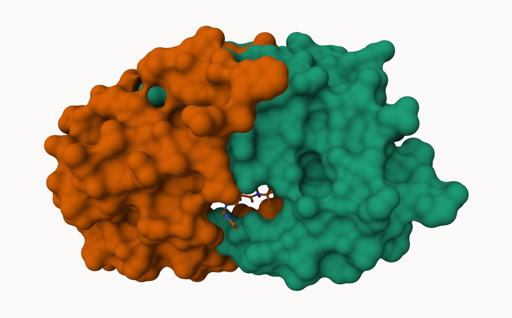
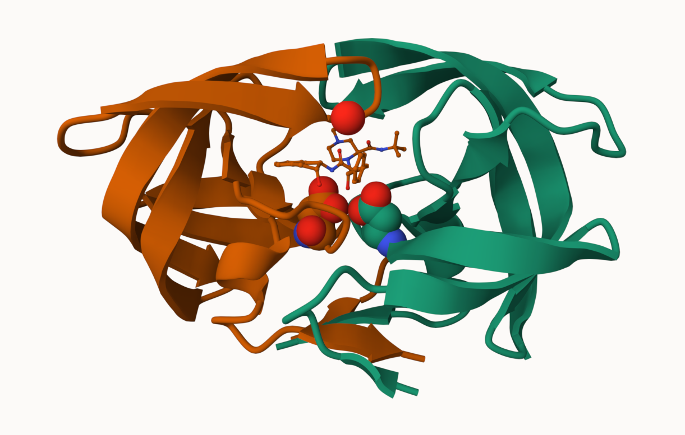

## Background

The main repository of high-resolution structural data on biomolecules is called the **Protein Data Bank** (PDB).

## PDB statistics

What is in the PDB in terms of molecule type and structure determination method?

Read a CSV file of current PDB stats obtained from https://www.rcsb.org/stats/summary

```{r}
pdb <- read.csv("Data Export Summary.csv")
pdb
```

> **Q1**: What percentage of structures in the PDB are solved by X-Ray and Electron Microscopy.

```{r}
pdb$X.ray
```

This print out above 'pdb$X.ray' is "character", not "numeric". Therefore, I can't do math with it. We need to fix this...

Two functions that can help here are 'sub()' and 

```{r}
# We want to get rid (or sub out) commas: 
x <- pdb$X.ray
tmp <- sub(",", "", x)
sum(as.numeric(tmp))
```

We could make a function to do this:

```{r}
rm.comma <- function(x) {
  tmp <- sub(",", "", x)
  sum(as.numeric(tmp))
}
```

```{r}
rm.comma(pdb$'X-ray')
rm.comma(pdb$EM)
```

We could also use a different input function for this CSV that speaks American (i.e. deals with commas in numbers in a comma separated value file)

```{r}
library(readr)

read_csv("Data Export Summary.csv")
```

```{r}
n.tot <- rm.comma(pdb$Total)
n.xray <- rm.comma(pdb$'X-ray')
n.em <- rm.comma(pdb$EM)

n.xray / n.tot * 100
n.em / n.tot * 100
```

> How many total protein structures are there 

```{r}
pdb$Total[1]
```

The total number of protein sequences in UniProt is 202,556,314.

```{r}
217375/202556314 * 100
```

> **Key point**: We have a very, very small structural coverage of known proteins (~0.1%). Most structures we know about (~80%) come from one method (X-ray).


## Visualizing PDB data with Mol-star

Main stand alone web version with all features is at https://molstar.org/viewer/


 




# Getting started with the Bio3D package

Bio3D is an R package fro CRAN for structural bioinformatics

```{r}
library(bio3d)

pdb <- read.pdb("1hsg")
pdb

head(pdb$atom)
```

There are lots of functions that can work with these 'pdb' objects:

```{r}
head(pdbseq(pdb))
```

We can have a quick interactive view of any of these 'pdb' objects:

```{r}
#| eval: !expr knitr::is_html_output()

library(bio3dview)

view.pdb(pdb)
```

Let's try a custom view.

```{r}
#| eval: !expr knitr::is_html_output()

view.pdb(pdb, colorScheme="sse", backgroundColor="black")
```

> Q. Create a custom view of HIV-Pr highlighting the active site ASP ('resno=25'), the two chains (in your choice of colors), and the ligand all on a custom color background.

```{r}
#| eval: !expr knitr::is_html_output()

active.site <- atom.select(pdb, resno=25)

library(NGLVieweR)

view.pdb(pdb, 
         cols <- c("red", "blue"),
         highlight = active.site, 
         backgroundColor = "pink",
         highlight.style = "spacefill") |>
  setRock()
```


## Predict the flexibility of a given structure

Let's do a Normal Mode Analysis (NMA) to predict the flexibility of a given 'pdb' object:

```{r}
adk <- read.pdb("6s36")
```

A quick structure summary

```{r}
adk
```

```{r}
m <- nma(adk)
plot(m)
```

```{r}
#| eval: !expr knitr::is_html_output()

view.nma(m)
```

Write out the results for viewing in Mol-star:

```{r}
#| eval: !expr knitr::is_html_output()

mktrj(m, file="nma.pdb")
```


## Comparative analysis of the ADK family

Our first step is to find a sequence for this family. We will use the database ID "1ake_A" here:

```{r}
id <- "1ake_A"

aa <- get.seq(id)
aa
```

Search for related sequences in the database

```{r}
blast <- blast.pdb(aa)
```

```{r}
head(blast$hit.tbl)
```

```{r}
hits <- plot(blast)
```

```{r}
head(hits$pdb.id)
```

```{r}
files <- get.pdb(hits$pdb.id, path="pdbs")
```

Align and superpose all these ADK structures

```{r}
pdbs <- pdbaln(files, fit = TRUE, exefile="msa")
```

```{r}
#| eval: !expr knitr::is_html_output()

view.pdbs(pdbs)
```

PCA of all this strucural data 

```{r}
pc <- pca(pdbs)
plot(pc)
```

```{r}
plot(pc, 1:2)
```

Interactive view of the PC1 captured structural differences:

```{r}
#| eval: !expr knitr::is_html_output()

view.pca(pc)
```


```{r}
mktrj(pc, file = "pca.pdb")
```

