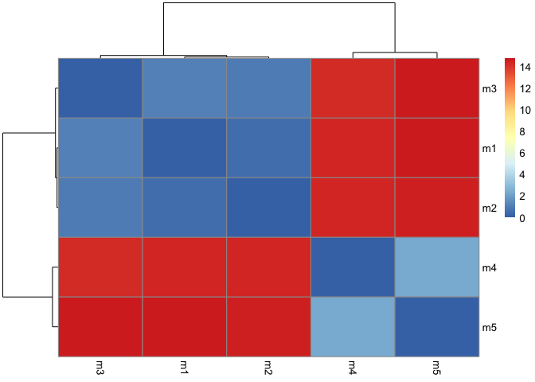
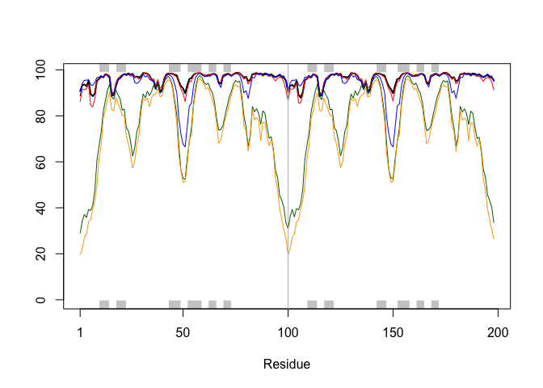

# Class 11: Protein Structure Prediction with AlphaFold
Dea Sinaga (PID: A17725676)

``` r
results_dir <- "hivpr_dimer_23119/"

pdb_files <- list.files(path=results_dir,
                        pattern="*.pdb",
                        full.names = TRUE)

basename(pdb_files)
```

    [1] "hivpr_dimer_23119_unrelaxed_rank_001_alphafold2_multimer_v3_model_4_seed_000.pdb"
    [2] "hivpr_dimer_23119_unrelaxed_rank_002_alphafold2_multimer_v3_model_1_seed_000.pdb"
    [3] "hivpr_dimer_23119_unrelaxed_rank_003_alphafold2_multimer_v3_model_5_seed_000.pdb"
    [4] "hivpr_dimer_23119_unrelaxed_rank_004_alphafold2_multimer_v3_model_2_seed_000.pdb"
    [5] "hivpr_dimer_23119_unrelaxed_rank_005_alphafold2_multimer_v3_model_3_seed_000.pdb"

``` r
library(bio3d)

pdbs <- pdbaln(pdb_files, fit=TRUE, exefile="msa")
```

    Reading PDB files:
    hivpr_dimer_23119//hivpr_dimer_23119_unrelaxed_rank_001_alphafold2_multimer_v3_model_4_seed_000.pdb
    hivpr_dimer_23119//hivpr_dimer_23119_unrelaxed_rank_002_alphafold2_multimer_v3_model_1_seed_000.pdb
    hivpr_dimer_23119//hivpr_dimer_23119_unrelaxed_rank_003_alphafold2_multimer_v3_model_5_seed_000.pdb
    hivpr_dimer_23119//hivpr_dimer_23119_unrelaxed_rank_004_alphafold2_multimer_v3_model_2_seed_000.pdb
    hivpr_dimer_23119//hivpr_dimer_23119_unrelaxed_rank_005_alphafold2_multimer_v3_model_3_seed_000.pdb
    .....

    Extracting sequences

    pdb/seq: 1   name: hivpr_dimer_23119//hivpr_dimer_23119_unrelaxed_rank_001_alphafold2_multimer_v3_model_4_seed_000.pdb 
    pdb/seq: 2   name: hivpr_dimer_23119//hivpr_dimer_23119_unrelaxed_rank_002_alphafold2_multimer_v3_model_1_seed_000.pdb 
    pdb/seq: 3   name: hivpr_dimer_23119//hivpr_dimer_23119_unrelaxed_rank_003_alphafold2_multimer_v3_model_5_seed_000.pdb 
    pdb/seq: 4   name: hivpr_dimer_23119//hivpr_dimer_23119_unrelaxed_rank_004_alphafold2_multimer_v3_model_2_seed_000.pdb 
    pdb/seq: 5   name: hivpr_dimer_23119//hivpr_dimer_23119_unrelaxed_rank_005_alphafold2_multimer_v3_model_3_seed_000.pdb 

``` r
pdbs
```

                                   1        .         .         .         .         50 
    [Truncated_Name:1]hivpr_dime   PQITLWQRPLVTIKIGGQLKEALLDTGADDTVLEEMSLPGRWKPKMIGGI
    [Truncated_Name:2]hivpr_dime   PQITLWQRPLVTIKIGGQLKEALLDTGADDTVLEEMSLPGRWKPKMIGGI
    [Truncated_Name:3]hivpr_dime   PQITLWQRPLVTIKIGGQLKEALLDTGADDTVLEEMSLPGRWKPKMIGGI
    [Truncated_Name:4]hivpr_dime   PQITLWQRPLVTIKIGGQLKEALLDTGADDTVLEEMSLPGRWKPKMIGGI
    [Truncated_Name:5]hivpr_dime   PQITLWQRPLVTIKIGGQLKEALLDTGADDTVLEEMSLPGRWKPKMIGGI
                                   ************************************************** 
                                   1        .         .         .         .         50 

                                  51        .         .         .         .         100 
    [Truncated_Name:1]hivpr_dime   GGFIKVRQYDQILIEICGHKAIGTVLVGPTPVNIIGRNLLTQIGCTLNFP
    [Truncated_Name:2]hivpr_dime   GGFIKVRQYDQILIEICGHKAIGTVLVGPTPVNIIGRNLLTQIGCTLNFP
    [Truncated_Name:3]hivpr_dime   GGFIKVRQYDQILIEICGHKAIGTVLVGPTPVNIIGRNLLTQIGCTLNFP
    [Truncated_Name:4]hivpr_dime   GGFIKVRQYDQILIEICGHKAIGTVLVGPTPVNIIGRNLLTQIGCTLNFP
    [Truncated_Name:5]hivpr_dime   GGFIKVRQYDQILIEICGHKAIGTVLVGPTPVNIIGRNLLTQIGCTLNFP
                                   ************************************************** 
                                  51        .         .         .         .         100 

                                 101        .         .         .         .         150 
    [Truncated_Name:1]hivpr_dime   QITLWQRPLVTIKIGGQLKEALLDTGADDTVLEEMSLPGRWKPKMIGGIG
    [Truncated_Name:2]hivpr_dime   QITLWQRPLVTIKIGGQLKEALLDTGADDTVLEEMSLPGRWKPKMIGGIG
    [Truncated_Name:3]hivpr_dime   QITLWQRPLVTIKIGGQLKEALLDTGADDTVLEEMSLPGRWKPKMIGGIG
    [Truncated_Name:4]hivpr_dime   QITLWQRPLVTIKIGGQLKEALLDTGADDTVLEEMSLPGRWKPKMIGGIG
    [Truncated_Name:5]hivpr_dime   QITLWQRPLVTIKIGGQLKEALLDTGADDTVLEEMSLPGRWKPKMIGGIG
                                   ************************************************** 
                                 101        .         .         .         .         150 

                                 151        .         .         .         .       198 
    [Truncated_Name:1]hivpr_dime   GFIKVRQYDQILIEICGHKAIGTVLVGPTPVNIIGRNLLTQIGCTLNF
    [Truncated_Name:2]hivpr_dime   GFIKVRQYDQILIEICGHKAIGTVLVGPTPVNIIGRNLLTQIGCTLNF
    [Truncated_Name:3]hivpr_dime   GFIKVRQYDQILIEICGHKAIGTVLVGPTPVNIIGRNLLTQIGCTLNF
    [Truncated_Name:4]hivpr_dime   GFIKVRQYDQILIEICGHKAIGTVLVGPTPVNIIGRNLLTQIGCTLNF
    [Truncated_Name:5]hivpr_dime   GFIKVRQYDQILIEICGHKAIGTVLVGPTPVNIIGRNLLTQIGCTLNF
                                   ************************************************ 
                                 151        .         .         .         .       198 

    Call:
      pdbaln(files = pdb_files, fit = TRUE, exefile = "msa")

    Class:
      pdbs, fasta

    Alignment dimensions:
      5 sequence rows; 198 position columns (198 non-gap, 0 gap) 

    + attr: xyz, resno, b, chain, id, ali, resid, sse, call

``` r
rd <- rmsd(pdbs, fit=T)
```

    Warning in rmsd(pdbs, fit = T): No indices provided, using the 198 non NA positions

``` r
range(rd)
```

    [1]  0.000 14.754

``` r
library(pheatmap)

colnames(rd) <- paste0("m",1:5)
rownames(rd) <- paste0("m",1:5)
pheatmap(rd)
```



``` r
pdb <- read.pdb("1hsg")
```

      Note: Accessing on-line PDB file

``` r
plotb3(pdbs$b[1,], typ="l", lwd=2, sse=pdb)
points(pdbs$b[2,], typ="l", col="red")
points(pdbs$b[3,], typ="l", col="blue")
points(pdbs$b[4,], typ="l", col="darkgreen")
points(pdbs$b[5,], typ="l", col="orange")
abline(v=100, col="gray")
```



``` r
core <- core.find(pdbs)
```

     core size 197 of 198  vol = 9836.196 
     core size 196 of 198  vol = 6800.793 
     core size 195 of 198  vol = 1322.091 
     core size 194 of 198  vol = 1032.249 
     core size 193 of 198  vol = 944.133 
     core size 192 of 198  vol = 894.048 
     core size 191 of 198  vol = 829.724 
     core size 190 of 198  vol = 766.628 
     core size 189 of 198  vol = 728.681 
     core size 188 of 198  vol = 693.317 
     core size 187 of 198  vol = 656.166 
     core size 186 of 198  vol = 622.063 
     core size 185 of 198  vol = 586.601 
     core size 184 of 198  vol = 565.358 
     core size 183 of 198  vol = 532.747 
     core size 182 of 198  vol = 511.421 
     core size 181 of 198  vol = 489.077 
     core size 180 of 198  vol = 468.599 
     core size 179 of 198  vol = 449.222 
     core size 178 of 198  vol = 433.122 
     core size 177 of 198  vol = 418.651 
     core size 176 of 198  vol = 405.069 
     core size 175 of 198  vol = 391.855 
     core size 174 of 198  vol = 381.006 
     core size 173 of 198  vol = 371.54 
     core size 172 of 198  vol = 355.539 
     core size 171 of 198  vol = 345.156 
     core size 170 of 198  vol = 335.982 
     core size 169 of 198  vol = 325.275 
     core size 168 of 198  vol = 313.603 
     core size 167 of 198  vol = 302.908 
     core size 166 of 198  vol = 293.343 
     core size 165 of 198  vol = 284.547 
     core size 164 of 198  vol = 277.932 
     core size 163 of 198  vol = 269.592 
     core size 162 of 198  vol = 258.167 
     core size 161 of 198  vol = 246.856 
     core size 160 of 198  vol = 239.073 
     core size 159 of 198  vol = 234.174 
     core size 158 of 198  vol = 226.309 
     core size 157 of 198  vol = 221.212 
     core size 156 of 198  vol = 214.951 
     core size 155 of 198  vol = 206.027 
     core size 154 of 198  vol = 197.301 
     core size 153 of 198  vol = 190.889 
     core size 152 of 198  vol = 185.403 
     core size 151 of 198  vol = 179.154 
     core size 150 of 198  vol = 174.709 
     core size 149 of 198  vol = 167.269 
     core size 148 of 198  vol = 160.866 
     core size 147 of 198  vol = 156.173 
     core size 146 of 198  vol = 148.395 
     core size 145 of 198  vol = 143.389 
     core size 144 of 198  vol = 138.428 
     core size 143 of 198  vol = 132.99 
     core size 142 of 198  vol = 126.924 
     core size 141 of 198  vol = 121.257 
     core size 140 of 198  vol = 116.407 
     core size 139 of 198  vol = 112.241 
     core size 138 of 198  vol = 107.813 
     core size 137 of 198  vol = 104.807 
     core size 136 of 198  vol = 100.968 
     core size 135 of 198  vol = 97.21 
     core size 134 of 198  vol = 92.54 
     core size 133 of 198  vol = 87.964 
     core size 132 of 198  vol = 85.621 
     core size 131 of 198  vol = 81.514 
     core size 130 of 198  vol = 77.627 
     core size 129 of 198  vol = 74.881 
     core size 128 of 198  vol = 72.642 
     core size 127 of 198  vol = 70.352 
     core size 126 of 198  vol = 68.627 
     core size 125 of 198  vol = 66.349 
     core size 124 of 198  vol = 64.019 
     core size 123 of 198  vol = 61.763 
     core size 122 of 198  vol = 58.758 
     core size 121 of 198  vol = 56.354 
     core size 120 of 198  vol = 54.129 
     core size 119 of 198  vol = 51.611 
     core size 118 of 198  vol = 49.502 
     core size 117 of 198  vol = 48.045 
     core size 116 of 198  vol = 46.489 
     core size 115 of 198  vol = 44.599 
     core size 114 of 198  vol = 43.185 
     core size 113 of 198  vol = 40.978 
     core size 112 of 198  vol = 39.029 
     core size 111 of 198  vol = 36.363 
     core size 110 of 198  vol = 33.953 
     core size 109 of 198  vol = 31.343 
     core size 108 of 198  vol = 29.304 
     core size 107 of 198  vol = 27.188 
     core size 106 of 198  vol = 25.655 
     core size 105 of 198  vol = 24.03 
     core size 104 of 198  vol = 22.504 
     core size 103 of 198  vol = 20.906 
     core size 102 of 198  vol = 19.803 
     core size 101 of 198  vol = 18.215 
     core size 100 of 198  vol = 15.652 
     core size 99 of 198  vol = 14.762 
     core size 98 of 198  vol = 11.574 
     core size 97 of 198  vol = 9.391 
     core size 96 of 198  vol = 7.327 
     core size 95 of 198  vol = 6.123 
     core size 94 of 198  vol = 5.592 
     core size 93 of 198  vol = 4.689 
     core size 92 of 198  vol = 3.66 
     core size 91 of 198  vol = 2.779 
     core size 90 of 198  vol = 2.147 
     core size 89 of 198  vol = 1.725 
     core size 88 of 198  vol = 1.158 
     core size 87 of 198  vol = 0.88 
     core size 86 of 198  vol = 0.682 
     core size 85 of 198  vol = 0.527 
     core size 84 of 198  vol = 0.37 
     FINISHED: Min vol ( 0.5 ) reached

``` r
core.inds <- print(core, vol=0.5)
```

    # 85 positions (cumulative volume <= 0.5 Angstrom^3) 
      start end length
    1     9  49     41
    2    52  95     44

``` r
xyz <- pdbfit(pdbs, core.inds, outpath="corefit_structures")
```

``` r
rf <- rmsf(xyz)

plotb3(rf, sse=pdb)
abline(v=100, col="gray", ylab="RMSF")
```


``` r
library(jsonlite)

pae_files <- list.files(path=results_dir,
                        pattern=".*model.*\\.json",
                        full.names = TRUE)
```

``` r
pae1 <- read_json(pae_files[1],simplifyVector = TRUE)
pae5 <- read_json(pae_files[5],simplifyVector = TRUE)

attributes(pae1)
```

    $names
    [1] "plddt"   "max_pae" "pae"     "ptm"     "iptm"   

``` r
head(pae1$plddt) 
```

    [1] 90.81 93.25 93.69 92.88 95.25 89.44

``` r
plot.dmat(pae1$pae,
          xlab = "Residue Position (i)",
          ylab = "Residue Position (j)")
```


``` r
plot.dmat(pae5$pae,
          xlab = "Residue Position (i)",
          ylab = "Residue Position (j)",
          grid.col = "black",
          zlim = c(0,30))
```


``` r
plot.dmat(pae1$pae,
          xlab = "Residue Position (i)",
          ylab = "Residue Position (j)",
          grid.col = "black",
          zlim = c(0,30))
```


``` r
aln_file <- list.files(path=results_dir,
                       pattern=".a3m$",
                        full.names = TRUE)
aln_file
```

    [1] "hivpr_dimer_23119//hivpr_dimer_23119.a3m"

``` r
aln <- read.fasta(aln_file[1], to.upper = TRUE)
```

    [1] " ** Duplicated sequence id's: 101 **"
    [2] " ** Duplicated sequence id's: 101 **"

``` r
dim(aln$ali)
```

    [1] 5397  132

``` r
sim <- conserv(aln)
```

``` r
plotb3(sim[1:99], sse=trim.pdb(pdb, chain="A"),
       ylab = "Conservation Score")
```


``` r
con <- consensus(aln, cutoff = 0.9)
con$seq
```

      [1] "-" "-" "-" "-" "-" "-" "-" "-" "-" "-" "-" "-" "-" "-" "-" "-" "-" "-"
     [19] "-" "-" "-" "-" "-" "-" "D" "T" "G" "A" "-" "-" "-" "-" "-" "-" "-" "-"
     [37] "-" "-" "-" "-" "-" "-" "-" "-" "-" "-" "-" "-" "-" "-" "-" "-" "-" "-"
     [55] "-" "-" "-" "-" "-" "-" "-" "-" "-" "-" "-" "-" "-" "-" "-" "-" "-" "-"
     [73] "-" "-" "-" "-" "-" "-" "-" "-" "-" "-" "-" "-" "-" "-" "-" "-" "-" "-"
     [91] "-" "-" "-" "-" "-" "-" "-" "-" "-" "-" "-" "-" "-" "-" "-" "-" "-" "-"
    [109] "-" "-" "-" "-" "-" "-" "-" "-" "-" "-" "-" "-" "-" "-" "-" "-" "-" "-"
    [127] "-" "-" "-" "-" "-" "-"

``` r
m1.pdb <- read.pdb(pdb_files[1])
occ <- vec2resno(c(sim[1:99], sim[1:99]), m1.pdb$atom$resno)
write.pdb(m1.pdb, o=occ, file="m1_conserv.pdb")
```
