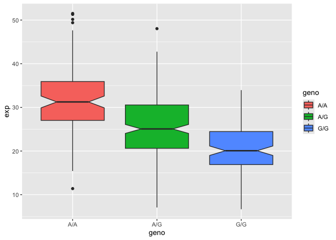

One sample is obviously not enough to know what is happening in a
population. You are interested in assessing genetic differences on a
population scale.

> **Q13.** Read this file into R and determine the sample size for each
> genotype and their corresponding median expression levels for each of
> these genotypes.

How many samples do we have?

    expr <- read.table("https://bioboot.github.io/bimm143_S26/class-material/rs8067378_ENSG00000172057.6.txt")

    head(expr)

    ##    sample geno      exp
    ## 1 HG00367  A/G 28.96038
    ## 2 NA20768  A/G 20.24449
    ## 3 HG00361  A/A 31.32628
    ## 4 HG00135  A/A 34.11169
    ## 5 NA18870  G/G 18.25141
    ## 6 NA11993  A/A 32.89721

    nrow(expr)

    ## [1] 462

The sample size for each genotype is shown below.

    table(expr$geno)

    ## 
    ## A/A A/G G/G 
    ## 108 233 121

    summary(expr)

    ##     sample              geno                exp        
    ##  Length:462         Length:462         Min.   : 6.675  
    ##  Class :character   Class :character   1st Qu.:20.004  
    ##  Mode  :character   Mode  :character   Median :25.116  
    ##                                        Mean   :25.640  
    ##                                        3rd Qu.:30.779  
    ##                                        Max.   :51.518

The median expression levels for each genotypes are shown below.

    tapply(expr$exp, expr$geno, median)

    ##      A/A      A/G      G/G 
    ## 31.24847 25.06486 20.07363

> **Q14.** Generate a boxplot with a box per genotype, what could you
> infer from the relative expression value between A/A and G/G displayed
> in this plot? Does the SNP effect the expression of ORMDL3?

    library(ggplot2)

    ggplot(expr) + aes(geno, exp, fill=geno) +
      geom_boxplot(notch=TRUE)

The boxplot shows that the expression levels of ORMDL3 in G/G
individuals are lower than that of A/A individuals. Thus, the SNP
affects the expression of ORMDL3, more specifically by decreasing it.
