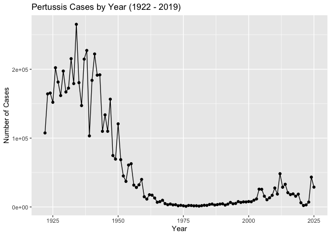
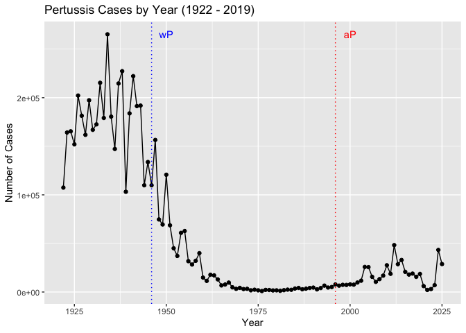
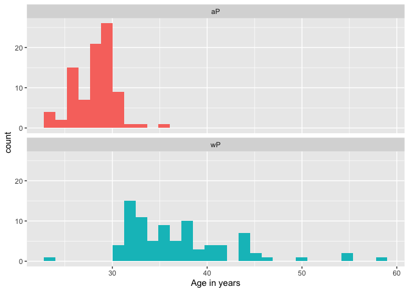
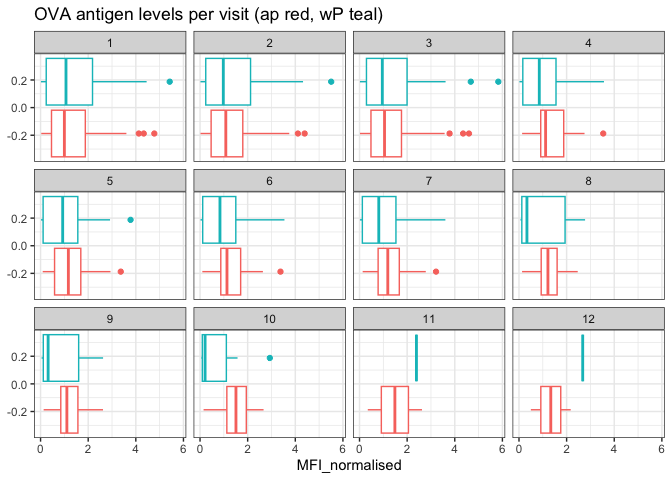
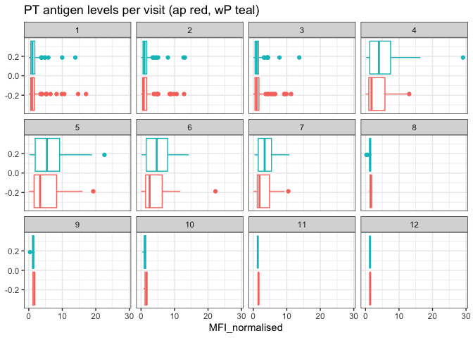
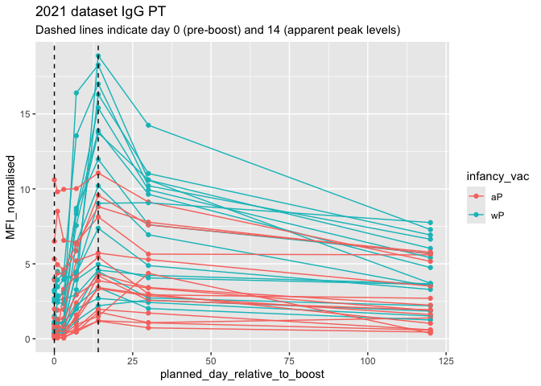
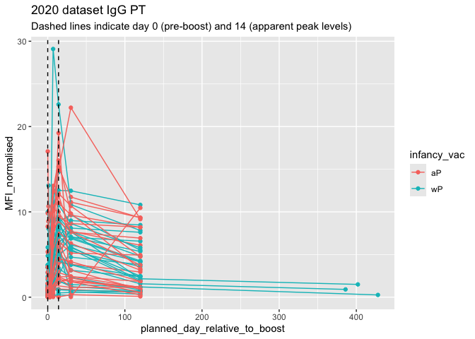

# Class 18: Pertussis and the CMI-PB project
Dea Sinaga (PID: A17725676)

- [Background](#background)
- [1. Investigating pertussis cases by
  year](#1-investigating-pertussis-cases-by-year)
- [2. A tale of two vaccines (wP &
  aP)](#2-a-tale-of-two-vaccines-wp--ap)
- [3. Exploring CMI-PB data](#3-exploring-cmi-pb-data)
- [4. Examine IgG Ab titer levels](#4-examine-igg-ab-titer-levels)
- [5. Obtaining CMI-PB RNASeq data](#5-obtaining-cmi-pb-rnaseq-data)

## Background

Pertussis (more commonly known as whooping cough) is a highly contagious
respiratory disease caused by the bacterium Bordetella pertussis.

## 1. Investigating pertussis cases by year

> **Q1.** With the help of the R “addin” package datapasta assign the
> CDC pertussis case number data to a data frame called cdc and use
> ggplot to make a plot of cases numbers over time.

Note: The link to the cdc pertussis data no longer works but it will
take you to a page on the CDC website with a graph about half-way down,
under which is a Download Data (CSV) link that has the data. You can
either try to use “datapasta” as suggested in the lab to extract the
data into your cdc data frame or you can download the linked file and
use read.csv() to upload it into a cdc data frame.

``` r
cdc <- read.csv("U.S. Reported Pertussis Cases_ 1922 - 2025.csv")

cdc$Number.of.Reported.Pertussis.Cases <- as.numeric(gsub("," , "" , cdc$Number.of.Reported.Pertussis.Cases))
```

``` r
head(cdc)
```

      Year Number.of.Reported.Pertussis.Cases Data.Status
    1 1922                             107473   Finalized
    2 1923                             164191   Finalized
    3 1924                             165418   Finalized
    4 1925                             152003   Finalized
    5 1926                             202210   Finalized
    6 1927                             181411   Finalized

``` r
library(ggplot2)
```

``` r
ggplot(cdc) +
  aes(x = Year, y = Number.of.Reported.Pertussis.Cases) +
  geom_point() +
  geom_line() +
  labs(title = "Pertussis Cases by Year (1922 - 2019)",
       x = "Year",
       y = "Number of Cases")
```



## 2. A tale of two vaccines (wP & aP)

Two types of pertussis vaccines have been developed: whole-cell
pertussis (wP) and acellular pertussis (aP). The first vaccines were
composed of ‘whole cell’ (wP) inactivated bacteria. The latter aP
vaccines use purified antigens of the bacteria

> **Q2.** Using the ggplot geom_vline() function add lines to your
> previous plot for the 1946 introduction of the wP vaccine and the 1996
> switch to aP vaccine (see example in the hint below). What do you
> notice?

``` r
ggplot(cdc) +
  aes(x = Year, y = Number.of.Reported.Pertussis.Cases) +
  geom_point() +
  geom_line() +
  geom_vline(xintercept = 1946, col = "blue", linetype = "dotted") +
  geom_vline(xintercept = 1996, col = "red", linetype = "dotted") +
  annotate("text", x = 1950, y = max(cdc$Number.of.Reported.Pertussis.Cases),
           label = "wP", col = "blue") +
  annotate("text", x = 2000, y = max(cdc$Number.of.Reported.Pertussis.Cases),
           label = "aP", col = "red") +
  labs(title = "Pertussis Cases by Year (1922 - 2019)",
       x = "Year",
       y = "Number of Cases")
```



I noticed from the graph above that the number of cases greatly
decreased after using wP vaccine, but slightly increased again after the
switch to aP.

> **Q3.** Describe what happened after the introduction of the aP
> vaccine? Do you have a possible explanation for the observed trend?

After the introduction of the aP vaccine, the number of cases increased.
One possible explanation is that people hesitated to get vaccines and
that the bacteria evolved to become immune ot the vaccine.

## 3. Exploring CMI-PB data

Why is this vaccine-preventable disease on the upswing? To answer this
question we need to investigate the mechanisms underlying waning
protection against pertussis.

**The CMI-PB API returns JSON data**

``` r
library(jsonlite)
```

``` r
subject <- read_json("https://www.cmi-pb.org/api/subject", simplifyVector = TRUE)
```

``` r
head(subject, 3)
```

      subject_id infancy_vac biological_sex              ethnicity  race
    1          1          wP         Female Not Hispanic or Latino White
    2          2          wP         Female Not Hispanic or Latino White
    3          3          wP         Female                Unknown White
      year_of_birth date_of_boost      dataset
    1    1986-01-01    2016-09-12 2020_dataset
    2    1968-01-01    2019-01-28 2020_dataset
    3    1983-01-01    2016-10-10 2020_dataset

> **Q4.** How many aP and wP infancy vaccinated subjects are in the
> dataset?

``` r
table(subject$infancy_vac)
```


    aP wP 
    87 85 

There are 87 aP and 85 wP infant vaccinated subjects.

> **Q5.** How many Male and Female subjects/patients are in the dataset?

``` r
table(subject$biological_sex)
```


    Female   Male 
       112     60 

There are 112 female patients and 60 male patients.

> **Q6.** What is the breakdown of race and biological sex (e.g. number
> of Asian females, White males etc…)?

``` r
tab <- table(subject$biological_sex, subject$race)
knitr::kable(tab)
```

|  | American Indian/Alaska Native | Asian | Black or African American | More Than One Race | Native Hawaiian or Other Pacific Islander | Unknown or Not Reported | White |
|:---|---:|---:|---:|---:|---:|---:|---:|
| Female | 0 | 32 | 2 | 15 | 1 | 14 | 48 |
| Male | 1 | 12 | 3 | 4 | 1 | 7 | 32 |

**Side-Note: Working with dates**

> **Q7.** Using this approach determine (i) the average age of wP
> individuals, (ii) the average age of aP individuals; and (iii) are
> they significantly different?

``` r
library(lubridate)
```


    Attaching package: 'lubridate'

    The following objects are masked from 'package:base':

        date, intersect, setdiff, union

1)  average age of wP individuals

``` r
subject$age <- today() - ymd(subject$year_of_birth)
```

``` r
library(dplyr)
```


    Attaching package: 'dplyr'

    The following objects are masked from 'package:stats':

        filter, lag

    The following objects are masked from 'package:base':

        intersect, setdiff, setequal, union

``` r
wP <- subject %>% filter(infancy_vac == "wP")
round(summary(time_length(wP$age, "years")))
```

       Min. 1st Qu.  Median    Mean 3rd Qu.    Max. 
         23      33      35      37      40      58 

The average age of wP individuals is 37.

2)  average age of aP individuals

``` r
aP <- subject %>% filter(infancy_vac == "aP")
round(summary(time_length(aP$age, "years")))
```

       Min. 1st Qu.  Median    Mean 3rd Qu.    Max. 
         23      27      28      28      29      35 

The average age of aP individuals is 28.

3)  are they significantly different

``` r
t.test(wP$age, aP$age)
```


        Welch Two Sample t-test

    data:  wP$age and aP$age
    t = 12.918 days, df = 104.03, p-value < 2.2e-16
    alternative hypothesis: true difference in means is not equal to 0
    95 percent confidence interval:
     2705.535 days 3686.855 days
    sample estimates:
    Time differences in days
    mean of x mean of y 
     13532.47  10336.28 

They are significantly different.

> **Q8.** Determine the age of all individuals at time of boost?

``` r
int <- ymd(subject$date_of_boost) - ymd(subject$year_of_birth)
age_at_boost <- time_length(int, "year")
head(age_at_boost)
```

    [1] 30.69678 51.07461 33.77413 28.65982 25.65914 28.77481

> **Q9.** With the help of a faceted boxplot or histogram (see below),
> do you think these two groups are significantly different?

``` r
ggplot(subject) +
  aes(time_length(age, "year"),
      fill=as.factor(infancy_vac)) +
  geom_histogram(show.legend=FALSE) +
  facet_wrap(vars(infancy_vac), nrow=2) +
  xlab("Age in years")
```

    `stat_bin()` using `bins = 30`. Pick better value `binwidth`.



Yes, they are significantly different.

**Joining multiple tables**

``` r
specimen <- read_json("https://www.cmi-pb.org/api/specimen", simplifyVector = TRUE) 

titer <- read_json("https://www.cmi-pb.org/api/plasma_ab_titer", simplifyVector = TRUE)
```

> **Q9.** Complete the code to join specimen and subject tables to make
> a new merged data frame containing all specimen records along with
> their associated subject details:

``` r
meta <- left_join(specimen, subject)
```

    Joining with `by = join_by(subject_id)`

``` r
dim(meta)
```

    [1] 1503   14

``` r
head(meta)
```

      specimen_id subject_id actual_day_relative_to_boost
    1           1          1                           -3
    2           2          1                            1
    3           3          1                            3
    4           4          1                            7
    5           5          1                           11
    6           6          1                           32
      planned_day_relative_to_boost specimen_type visit infancy_vac biological_sex
    1                             0         Blood     1          wP         Female
    2                             1         Blood     2          wP         Female
    3                             3         Blood     3          wP         Female
    4                             7         Blood     4          wP         Female
    5                            14         Blood     5          wP         Female
    6                            30         Blood     6          wP         Female
                   ethnicity  race year_of_birth date_of_boost      dataset
    1 Not Hispanic or Latino White    1986-01-01    2016-09-12 2020_dataset
    2 Not Hispanic or Latino White    1986-01-01    2016-09-12 2020_dataset
    3 Not Hispanic or Latino White    1986-01-01    2016-09-12 2020_dataset
    4 Not Hispanic or Latino White    1986-01-01    2016-09-12 2020_dataset
    5 Not Hispanic or Latino White    1986-01-01    2016-09-12 2020_dataset
    6 Not Hispanic or Latino White    1986-01-01    2016-09-12 2020_dataset
             age
    1 14757 days
    2 14757 days
    3 14757 days
    4 14757 days
    5 14757 days
    6 14757 days

> **Q10.** Now using the same procedure join meta with titer data so we
> can further analyze this data in terms of time of visit aP/wP,
> male/female etc.

``` r
abdata <- inner_join(titer, meta)
```

    Joining with `by = join_by(specimen_id)`

``` r
dim(abdata)
```

    [1] 52576    21

``` r
head(abdata)
```

      specimen_id isotype is_antigen_specific antigen        MFI MFI_normalised
    1           1     IgE               FALSE   Total 1110.21154       2.493425
    2           1     IgE               FALSE   Total 2708.91616       2.493425
    3           1     IgG                TRUE      PT   68.56614       3.736992
    4           1     IgG                TRUE     PRN  332.12718       2.602350
    5           1     IgG                TRUE     FHA 1887.12263      34.050956
    6           1     IgE                TRUE     ACT    0.10000       1.000000
       unit lower_limit_of_detection subject_id actual_day_relative_to_boost
    1 UG/ML                 2.096133          1                           -3
    2 IU/ML                29.170000          1                           -3
    3 IU/ML                 0.530000          1                           -3
    4 IU/ML                 6.205949          1                           -3
    5 IU/ML                 4.679535          1                           -3
    6 IU/ML                 2.816431          1                           -3
      planned_day_relative_to_boost specimen_type visit infancy_vac biological_sex
    1                             0         Blood     1          wP         Female
    2                             0         Blood     1          wP         Female
    3                             0         Blood     1          wP         Female
    4                             0         Blood     1          wP         Female
    5                             0         Blood     1          wP         Female
    6                             0         Blood     1          wP         Female
                   ethnicity  race year_of_birth date_of_boost      dataset
    1 Not Hispanic or Latino White    1986-01-01    2016-09-12 2020_dataset
    2 Not Hispanic or Latino White    1986-01-01    2016-09-12 2020_dataset
    3 Not Hispanic or Latino White    1986-01-01    2016-09-12 2020_dataset
    4 Not Hispanic or Latino White    1986-01-01    2016-09-12 2020_dataset
    5 Not Hispanic or Latino White    1986-01-01    2016-09-12 2020_dataset
    6 Not Hispanic or Latino White    1986-01-01    2016-09-12 2020_dataset
             age
    1 14757 days
    2 14757 days
    3 14757 days
    4 14757 days
    5 14757 days
    6 14757 days

> **Q11.** How many specimens (i.e. entries in abdata) do we have for
> each isotype?

``` r
table(abdata$isotype)
```


      IgE   IgG  IgG1  IgG2  IgG3  IgG4 
     6698  5389 10117 10124 10124 10124 

> **Q12.** What are the different \$dataset values in abdata and what do
> you notice about the number of rows for the most “recent” dataset?

``` r
table(abdata$dataset)
```


    2020_dataset 2021_dataset 2022_dataset 2023_dataset 
           31520         8085         7301         5670 

The most “recent” dataset has the least number of rows.

## 4. Examine IgG Ab titer levels

Now using our joined/merged/linked abdata dataset filter() for IgG
isotype.

``` r
igg <- abdata %>% filter(isotype == "IgG")
head(igg)
```

      specimen_id isotype is_antigen_specific antigen        MFI MFI_normalised
    1           1     IgG                TRUE      PT   68.56614       3.736992
    2           1     IgG                TRUE     PRN  332.12718       2.602350
    3           1     IgG                TRUE     FHA 1887.12263      34.050956
    4          19     IgG                TRUE      PT   20.11607       1.096366
    5          19     IgG                TRUE     PRN  976.67419       7.652635
    6          19     IgG                TRUE     FHA   60.76626       1.096457
       unit lower_limit_of_detection subject_id actual_day_relative_to_boost
    1 IU/ML                 0.530000          1                           -3
    2 IU/ML                 6.205949          1                           -3
    3 IU/ML                 4.679535          1                           -3
    4 IU/ML                 0.530000          3                           -3
    5 IU/ML                 6.205949          3                           -3
    6 IU/ML                 4.679535          3                           -3
      planned_day_relative_to_boost specimen_type visit infancy_vac biological_sex
    1                             0         Blood     1          wP         Female
    2                             0         Blood     1          wP         Female
    3                             0         Blood     1          wP         Female
    4                             0         Blood     1          wP         Female
    5                             0         Blood     1          wP         Female
    6                             0         Blood     1          wP         Female
                   ethnicity  race year_of_birth date_of_boost      dataset
    1 Not Hispanic or Latino White    1986-01-01    2016-09-12 2020_dataset
    2 Not Hispanic or Latino White    1986-01-01    2016-09-12 2020_dataset
    3 Not Hispanic or Latino White    1986-01-01    2016-09-12 2020_dataset
    4                Unknown White    1983-01-01    2016-10-10 2020_dataset
    5                Unknown White    1983-01-01    2016-10-10 2020_dataset
    6                Unknown White    1983-01-01    2016-10-10 2020_dataset
             age
    1 14757 days
    2 14757 days
    3 14757 days
    4 15853 days
    5 15853 days
    6 15853 days

> **Q13.** Complete the following code to make a summary boxplot of Ab
> titer levels (MFI) for all antigens:

``` r
ggplot(igg) +
  aes(MFI_normalised, antigen) +
  geom_boxplot() + 
  xlim(0,75) +
  facet_wrap(vars(visit), nrow=2)
```

    Warning: Removed 5 rows containing non-finite outside the scale range
    (`stat_boxplot()`).


> **Q14.** What antigens show differences in the level of IgG antibody
> titers recognizing them over time? Why these and not others?

Based on the box plot above, PT, PRN, FIM2/3, and FHA show clear
differences in the level of IgG antibody titers. The booster contains
pertussis-related antigens, so the antigen levels targeted by the
vaccines would increase over time.

> **Q15.** Filter to pull out only two specific antigens for analysis
> and create a boxplot for each. You can chose any you like. Below I
> picked a “control” antigen (“OVA”, that is not in our vaccines) and a
> clear antigen of interest (“PT”, Pertussis Toxin, one of the key
> virulence factors produced by the bacterium B. pertussis).

``` r
filter(igg, antigen=="OVA") %>%
  ggplot() +
  aes(MFI_normalised, col=infancy_vac) +
  geom_boxplot(show.legend = FALSE) +
  facet_wrap(vars(visit)) +
  theme_bw() +
  labs(title = "OVA antigen levels per visit (ap red, wP teal)")
```



``` r
filter(igg, antigen=="PT") %>%
  ggplot() +
  aes(MFI_normalised, col=infancy_vac) +
  geom_boxplot(show.legend = FALSE) +
  facet_wrap(vars(visit)) +
  theme_bw() +
  labs(title = "PT antigen levels per visit (ap red, wP teal)")
```



> **Q16.** What do you notice about these two antigens time courses and
> the PT data in particular?

PT levels increase over time and exceeds OVA. It looks like PT levels
(both for aP and wP) peaked at visit 5 and slightly decreased after.

> **Q17.** Do you see any clear difference in aP vs. wP responses?

No, the responses for aP and wP seem to have a similar trend.

Lets finish this section by looking at the 2021 dataset IgG PT antigen
levels time-course:

``` r
abdata.21 <- abdata %>% filter(dataset == "2021_dataset")

abdata.21 %>% 
  filter(isotype == "IgG",  antigen == "PT") %>%
  ggplot() +
    aes(x=planned_day_relative_to_boost,
        y=MFI_normalised,
        col=infancy_vac,
        group=subject_id) +
    geom_point() +
    geom_line() +
    geom_vline(xintercept=0, linetype="dashed") +
    geom_vline(xintercept=14, linetype="dashed") +
  labs(title="2021 dataset IgG PT",
       subtitle = "Dashed lines indicate day 0 (pre-boost) and 14 (apparent peak levels)")
```



> **Q18.** Does this trend look similar for the 2020 dataset?

``` r
abdata.20 <- abdata %>% filter(dataset == "2020_dataset")

abdata.20 %>% 
  filter(isotype == "IgG",  antigen == "PT") %>%
  ggplot() +
    aes(x=planned_day_relative_to_boost,
        y=MFI_normalised,
        col=infancy_vac,
        group=subject_id) +
    geom_point() +
    geom_line() +
    geom_vline(xintercept=0, linetype="dashed") +
    geom_vline(xintercept=14, linetype="dashed") +
  labs(title="2020 dataset IgG PT",
       subtitle = "Dashed lines indicate day 0 (pre-boost) and 14 (apparent peak levels)")
```



No, it doesn’t look similar.

## 5. Obtaining CMI-PB RNASeq data

For RNA-Seq data the API query mechanism quickly hits the web browser
interface limit for file size. However, we can still do “targeted”
RNA-Seq querys via the web accessible API.

``` r
url <- "https://www.cmi-pb.org/api/v2/rnaseq?versioned_ensembl_gene_id=eq.ENSG00000211896.7"

rna <- read_json(url, simplifyVector = TRUE) 
```

``` r
#meta <- inner_join(specimen, subject)
ssrna <- inner_join(rna, meta)
```

    Joining with `by = join_by(specimen_id)`

> **Q19.** Make a plot of the time course of gene expression for IGHG1
> gene (i.e. a plot of visit vs. tpm).

``` r
ggplot(ssrna) +
  aes(visit, tpm, group=subject_id) +
  geom_point() +
  geom_line(alpha=0.2)
```


> **Q20.** What do you notice about the expression of this gene
> (i.e. when is it at it’s maximum level)?

It’s at its maximum level around the 4th and 8th visits.

> **Q21.** Does this pattern in time match the trend of antibody titer
> data? If not, why not?

Not exactly because antibodies are generated later than the ssRNA
response.
